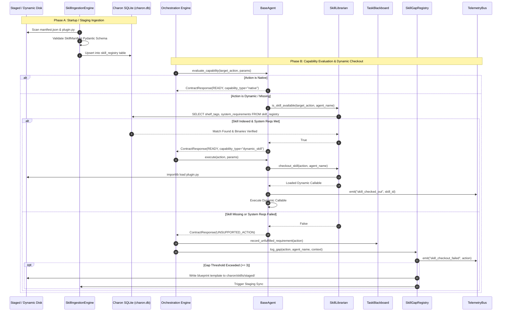

# CHARON — Technical Design Specification
## Dynamic Skill Checkout & PartVault Sync Ecosystem

**Storage Path**: `docs/design/dynamic_skill_ecosystem_spec.md`  
**System Target**: Charon Daemon v0.1.0+ (`charond`)  
**Status**: Approved / Sprint Architecture Spec  
**Author**: Charon Engineering  

---

## 1.0 System Architecture & Context

This document provides the complete technical specification, Pydantic schemas, SQL queries, and execution flow diagrams for the **Dynamic Skill & Sync Ecosystem**. 

The architecture operates on a **Hybrid File-Source + SQLite Index** pattern with strict database domain isolation:
1. **Templates on Disk:** Skills are authored as clean disk templates (`manifest.json` + `plugin.py`) located in `charon/skills/dynamic/`, `charon/skills/staged/`, or `~/.local/share/charon/skills/`.
2. **Ingestion Engine:** At startup or on file events, the `SkillIngestionEngine` scans disk templates, validates Pydantic schemas, verifies binary dependencies (`shutil.which`), and compiles an index into Charon's local database (`~/.local/share/charon/charon.db` -> `skill_registry`).
3. **Sub-Millisecond Checkout:** Specialist agents negotiate capabilities via sub-millisecond SQLite queries before dynamically importing executable plugin modules via `importlib`.
4. **Automated Staging Pipeline:** Unfulfilled capability requests logged by agents trigger auto-synthesis of `SkillBlueprint` specifications in `charon/skills/staged/` once a gap threshold ($\ge 3$) is reached.
5. **Isolated PartVault Sync:** PartVault operations remain strictly isolated within `~/.local/share/partvault/partvault.db` (`system_metadata`), queried exclusively by `The_Quartermaster` agent over IPC/REST APIs.

### 1.1 Database Domain & XDG Path Allocation

* **Charon Local DB (`~/.local/share/charon/charon.db`):** Owned by `charond`. Holds `skill_registry`, `skill_gaps`, and `blackboard_state`.
* **PartVault DB (`~/.local/share/partvault/partvault.db`):** Owned by PartVault / `The_Quartermaster`. Holds `system_metadata` and `parts_catalog`.
* **Skill Disk Storage:** `charon/skills/dynamic/`, `charon/skills/staged/`, and `~/.local/share/charon/skills/`.

### 1.2 High-Level Capability, Ingestion & Checkout Flow



---

## 2.0 Component Technical Specifications

### 2.1 Task 1: Core Skill Model & Hybrid Librarian
**Target File**: `charon/core/skills.py`

#### 2.1.1 Pydantic Manifest Schema (`SkillManifest`)
```python
from typing import Any, Dict, List, Optional
from pydantic import BaseModel, Field

class SkillManifest(BaseModel):
    """Schema governing dynamic skill plugin manifests (manifest.json)."""
    skill_id: str = Field(..., description="Unique skill identifier, e.g. 'kicad_autoroute'")
    shelf_tags: List[str] = Field(
        default_factory=list, 
        description="Target agent names or wildcards, e.g. ['The_Spark', 'The_Engineer'] or ['*']"
    )
    supported_actions: Dict[str, str] = Field(
        ..., 
        description="Map of supported action keys to python entry point methods, e.g. {'autoroute_board': 'run_freerouting'}"
    )
    system_requirements: List[str] = Field(
        default_factory=list, 
        description="Required CLI binaries or system utilities, e.g. ['kicad-cli', 'java']"
    )
    consumed_artifacts: List[str] = Field(default_factory=list, description="Expected input file extensions/types")
    produced_artifacts: List[str] = Field(default_factory=list, description="Generated output file extensions/types")
```

#### 2.1.2 Hybrid DB Lookup & Dynamic Module Execution (`SkillLibrarian`)
```python
import importlib.util
import json
import logging
import shutil
import sqlite3
from pathlib import Path
from typing import Any, Callable, Dict, List, Optional

logger = logging.getLogger("Charon.Core.Skills")

class SkillLibrarian:
    """Central authorization desk and execution switch backed by SQLite indexing."""
    
    def __init__(self, db_conn: sqlite3.Connection):
        self.db = db_conn

    def is_skill_available(self, action: str, agent_name: str) -> bool:
        """Queries local SQLite skill_registry for instant shelf-tag and binary health verification."""
        cursor = self.db.execute(
            "SELECT shelf_tags, system_requirements FROM skill_registry WHERE action_name = ? AND is_active = 1",
            (action,)
        )
        row = cursor.fetchone()
        if not row:
            return False

        shelf_tags = json.loads(row["shelf_tags"])
        system_requirements = json.loads(row["system_requirements"])

        # Shelf-tag authorization check
        if "*" not in shelf_tags and agent_name not in shelf_tags:
            logger.warning(f"[LIBRARIAN] Agent '{agent_name}' unauthorized for skill '{action}'.")
            return False

        # System requirement binary check
        return all(shutil.which(req) is not None for req in system_requirements)

    def checkout_skill(self, action: str, agent_name: str) -> Optional[Callable]:
        """Validates authorization and imports physical module from indexed file path."""
        if not self.is_skill_available(action, agent_name):
            return None

        cursor = self.db.execute(
            "SELECT skill_id, entry_file_path, handler_name FROM skill_registry WHERE action_name = ?",
            (action,)
        )
        row = cursor.fetchone()
        if not row:
            return None

        entry_path = Path(row["entry_file_path"])
        if not entry_path.exists():
            logger.error(f"[LIBRARIAN] File missing for skill '{row['skill_id']}' at {entry_path}")
            return None

        spec = importlib.util.spec_from_file_location(
            f"charon.skills.dynamic.{row['skill_id']}", 
            entry_path
        )
        if spec is None or spec.loader is None:
            return None

        module = importlib.util.module_from_spec(spec)
        spec.loader.exec_module(module)
        return getattr(module, row["handler_name"], None)
```

---

### 2.2 Task 2: Agent Determinant Evaluation & Capability Negotiation
**Target File**: `charon/agents/base.py`

#### 2.2.1 Capability Probing & Dynamic Execution Switch (`BaseAgent`)
```python
from enum import Enum
import shutil
import asyncio
from typing import Any, Dict, Optional, List
from pydantic import BaseModel

class CapabilityType(str, Enum):
    NATIVE = "native"
    DYNAMIC_SKILL = "dynamic_skill"
    UNSUPPORTED = "unsupported"

class ContractResponse(BaseModel):
    status: str
    capability_type: CapabilityType
    missing_prerequisites: List[str] = []

class BaseAgent:
    name: str = "BaseAgent"
    supported_actions: List[str] = []
    system_requirements: List[str] = []
    librarian: Optional[Any] = None

    def evaluate_capability(self, target_action: str, params: Optional[Dict[str, Any]] = None) -> ContractResponse:
        # 1. Native Determinant Check
        if target_action in self.supported_actions:
            missing_reqs = [req for req in self.system_requirements if shutil.which(req) is None]
            if missing_reqs:
                return ContractResponse(
                    status="CAPABILITY_GAP",
                    capability_type=CapabilityType.NATIVE,
                    missing_prerequisites=missing_reqs
                )
            return ContractResponse(status="READY", capability_type=CapabilityType.NATIVE)

        # 2. Dynamic Librarian Checkout Check
        if self.librarian and self.librarian.is_skill_available(target_action, agent_name=self.name):
            return ContractResponse(status="READY", capability_type=CapabilityType.DYNAMIC_SKILL)

        return ContractResponse(status="UNSUPPORTED_ACTION", capability_type=CapabilityType.UNSUPPORTED)

    async def execute(self, action: str, params: Dict[str, Any]) -> Any:
        # Native method execution
        if hasattr(self, action) and callable(getattr(self, action)):
            method = getattr(self, action)
            if asyncio.iscoroutinefunction(method):
                return await method(params)
            return method(params)

        # Dynamic skill execution
        if self.librarian:
            skill_handler = self.librarian.checkout_skill(action, agent_name=self.name)
            if skill_handler:
                if asyncio.iscoroutinefunction(skill_handler):
                    return await skill_handler(self, params)
                return skill_handler(self, params)

        raise NotImplementedError(f"Action '{action}' is not executable by {self.name}.")
```

---

### 2.3 Task 3: Skill Ingestion Engine & Database Index
**Target File**: `charon/core/skills_ingestion.py`

#### 2.3.1 SQLite Schema (`charon.db`)
```sql
CREATE TABLE IF NOT EXISTS skill_registry (
    action_name TEXT PRIMARY KEY,
    skill_id TEXT NOT NULL,
    shelf_tags TEXT NOT NULL,          -- JSON array e.g. '["The_Spark", "The_Engineer"]'
    system_requirements TEXT NOT NULL, -- JSON array e.g. '["kicad-cli"]'
    entry_file_path TEXT NOT NULL,    -- Absolute path to plugin.py
    handler_name TEXT NOT NULL,       -- Method name inside plugin.py
    is_active INTEGER DEFAULT 1,
    indexed_at TIMESTAMP DEFAULT CURRENT_TIMESTAMP
);
```

#### 2.3.2 Template Ingestion Engine (`SkillIngestionEngine`)
```python
import json
import logging
import sqlite3
from pathlib import Path
from typing import List, Optional
from charon.core.skills import SkillManifest

logger = logging.getLogger("Charon.Core.Ingestion")

class SkillIngestionEngine:
    """Scans disk templates, validates Pydantic schemas, and compiles index entries into SQLite."""

    def __init__(self, db_conn: sqlite3.Connection, search_paths: Optional[List[Path]] = None):
        self.db = db_conn
        self.search_paths = search_paths or [
            Path("charon/skills/dynamic"),
            Path("charon/skills/staged"),
            Path.home() / ".local/share/charon/skills"
        ]

    def sync_disk_to_db(self) -> int:
        """Scans disk manifests and compiles them into the SQLite skill_registry table."""
        indexed_count = 0
        
        for search_path in self.search_paths:
            expanded = search_path.expanduser().resolve()
            if not expanded.exists():
                continue

            for manifest_path in expanded.rglob("manifest.json"):
                try:
                    manifest = SkillManifest.model_validate_json(manifest_path.read_text(encoding="utf-8"))
                    skill_dir = manifest_path.parent
                    entry_file = skill_dir / "plugin.py"

                    if not entry_file.exists():
                        logger.warning(f"Plugin code missing at {entry_file}, skipping ingestion.")
                        continue

                    for action_name, handler_name in manifest.supported_actions.items():
                        self.db.execute(
                            """
                            INSERT INTO skill_registry 
                            (action_name, skill_id, shelf_tags, system_requirements, entry_file_path, handler_name, is_active, indexed_at)
                            VALUES (?, ?, ?, ?, ?, ?, 1, CURRENT_TIMESTAMP)
                            ON CONFLICT(action_name) DO UPDATE SET
                                skill_id = excluded.skill_id,
                                shelf_tags = excluded.shelf_tags,
                                system_requirements = excluded.system_requirements,
                                entry_file_path = excluded.entry_file_path,
                                handler_name = excluded.handler_name,
                                is_active = 1,
                                indexed_at = CURRENT_TIMESTAMP;
                            """,
                            (
                                action_name,
                                manifest.skill_id,
                                json.dumps(manifest.shelf_tags),
                                json.dumps(manifest.system_requirements),
                                str(entry_file.resolve()),
                                handler_name,
                            )
                        )
                        indexed_count += 1
                except Exception as e:
                    logger.error(f"Failed to ingest manifest at {manifest_path}: {e}")

        self.db.commit()
        logger.info(f"[INGESTION] Successfully indexed {indexed_count} actions into SQLite skill_registry.")
        return indexed_count
```

---

### 2.4 Task 4: Automated Staging Pipeline & Gap Registry
**Target Files**: `charon/core/gap_registry.py`, `charon/core/coordinator/orchestrator.py`

When an agent reports `UNSUPPORTED_ACTION`, the coordinator routes the gap to `SkillGapRegistry`. When a gap count reaches threshold ($\ge 3$), the system auto-synthesizes blueprint templates into `charon/skills/staged/<action_name>/`.

#### 2.4.1 Gap Logging & Coordinator Escalation
```python
async def dispatch_task(self, action_name: str, payload: dict):
    contract = agent.evaluate_capability(action_name)
    
    if contract.status == "READY":
        return await agent.execute(action_name, payload)
        
    self.blackboard.record_unfulfilled_requirement(
        action=action_name,
        agent=agent.name,
        missing_reqs=contract.missing_prerequisites
    )
    
    blueprint = self.gap_registry.log_gap(
        action_name=action_name,
        agent_name=agent.name,
        context=payload
    )
    
    await self.telemetry_bus.broadcast({
        "event_type": "skill_checkout_failed",
        "action": action_name,
        "agent": agent.name,
        "blueprint_created": blueprint is not None
    })
```

---

### 2.5 Task 5: PartVault Database Metadata & Sync Protocol
**Target Files**: `partvault/db.py`, `charon/agents/quartermaster/agent.py`

PartVault maintains key-value sync metadata inside its isolated SQLite database at `~/.local/share/partvault/partvault.db`.

#### 2.5.1 Key-Value Schema & Upsert SQL
```sql
CREATE TABLE IF NOT EXISTS system_metadata (
    key TEXT PRIMARY KEY,
    value TEXT NOT NULL,
    updated_at TIMESTAMP DEFAULT CURRENT_TIMESTAMP
);

INSERT INTO system_metadata (key, value, updated_at)
VALUES ('last_synced_at', :sync_time, CURRENT_TIMESTAMP)
ON CONFLICT(key) DO UPDATE SET
    value = excluded.value,
    updated_at = CURRENT_TIMESTAMP;
```

---

## 3.0 Verification & Testing Suite Specs

| Test Module | Coverage Objective | Target Mock / Assertion |
| :--- | :--- | :--- |
| `tests/test_skill_ingestion.py` | Verify disk template compilation to SQLite | Ingest sample manifest; assert row creation in `skill_registry`. |
| `tests/test_skill_checkout.py` | Verify SQLite lookup & dynamic import | Assert `checkout_skill()` queries DB and loads/executes dynamic `plugin.py`. |
| `tests/test_gap_registry.py` | Verify capability gap auto-staging | Log 3 gaps; verify staged template creation in `charon/skills/staged/`. |
| `tests/test_partvault_sync.py` | Verify atomic SQLite metadata writes | Perform concurrent reads during WAL-mode `system_metadata` upserts on `partvault.db`. |

---

## 4.0 Associated Developer Specifications

- **`docs/PLUGINS.md`**: Guide for authoring dynamic skills, writing `manifest.json`, and defining shelf tags.
- **`docs/PARTVAULT_SYNC.md`**: Protocol specification for SQLite WAL key-value synchronization and REST force-sync endpoints.