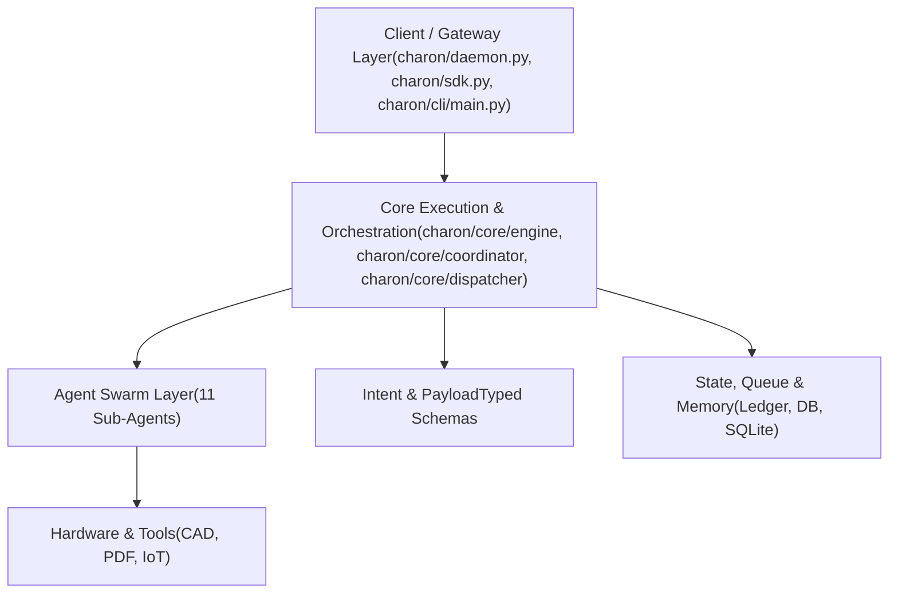
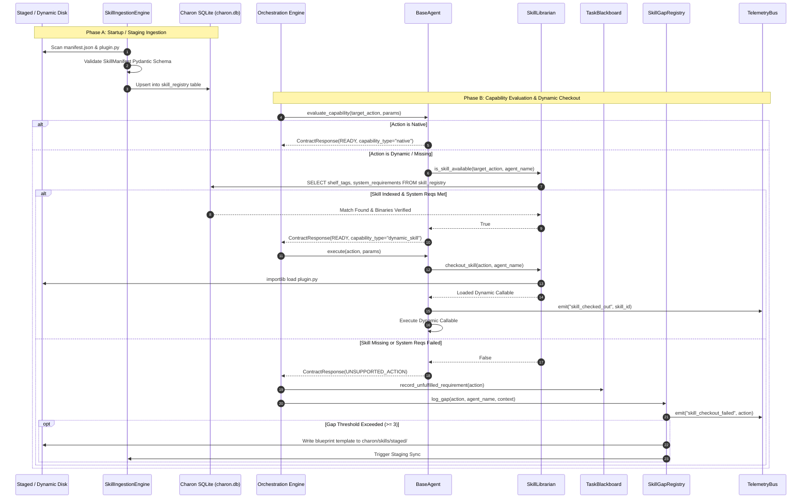

# Subsystem Domain Context: 01_Specs_and_Architecture
> **Generated:** 2026-08-09 18:25 UTC  
> **Charon Core Version:** v8.0  
> **Git Branch:** `Dynamic-Skill-Bus` | **Commit:** `13ca7e3`

---

## Target File: `README.md`

```markdown
# Charon (Digital Concierge)

**Privacy-first, local multi-agent AI orchestration daemon for Linux.**

Charon functions as an intelligent OS concierge running quietly in the background (`charond`). It orchestrates specialized AI agents to handle mechatronic hardware design (KiCad/PlatformIO), CAD/CAM digital fabrication (STEP/STL/G-code), system maintenance, web reconnaissance, vector memory indexing, and IoT automation.

For the full architectural charter, agent fleet description, and system vision, please consult [`docs/architecture/00_system_overview.md`](docs/architecture/00_system_overview.md).

---

## 🚀 Quickstart

### 1. Installation & Environment Setup
Ensure Python 3.12+ is installed on Linux:

```bash
# Clone repository and enter project directory
git clone [https://github.com/your-repo/charon.git](https://github.com/your-repo/charon.git)
cd charon

# Create virtual environment and install in editable mode with development tools
python3 -m venv .venv
source .venv/bin/activate
pip install -e .[dev]
```

### 2. Service Management (`systemctl`)
Charon runs natively as a user-level systemd daemon with kernel-enforced system isolation (`ProtectSystem=strict`):

```bash
# Enable and start the charond background service
systemctl --user daemon-reload
systemctl --user enable --now charond.service

# Check daemon health and real-time logs
systemctl --user status charond.service
journalctl --user -u charond.service -f
```

### 3. Launching Interactive CLI & Telemetry Monitor
Connect to the running `charond` daemon over WebSockets/REST:

```bash
# Primary terminal interactive shell
charon

# Stream live agent telemetry, reasoning chunks, and execution traces
charon telemetry

# Alternative explicit aliases
charon-cli
```

---

## 🛠️ Package Executables & Utility Commands

Installing `charon` provides the following CLI entry points and subcommands defined in `pyproject.toml`:

| Command / Subcommand | Target Python Entry Point | Description |
| :--- | :--- | :--- |
| `charon` | `charon.cli.main:main` | Interactive terminal UI / REPL for daemon communication. |
| `charon telemetry` | `charon.cli.main:main` | Real-time WebSocket trace monitor for agent execution logs, reasoning chunks, and telemetry. |
| `charon-cli` | `charon.cli.main:main` | Direct alias for `charon`. |
| `charond` | `charon.daemon:main` | Core background FastAPI + WebSocket daemon process. |
| `charon-forge` | `charon.skill_forge_cli:main` | Developer utility for generating and testing new agent skills. |

---

## 🧪 Testing, Artifacts & Version Management

Run the test suite using `pytest` with coverage reporting and strict workspace state validation:

```bash
# Run full unit and integration test suite
pytest

# Enforce clean workspace state (halts execution if uncommitted Git changes exist)
pytest --fail-on-dirty
```

### Versioning & Header Automation
Charon enforces deterministic versioning tied to Git commit SHAs, global Semantic Versioning, and per-file revision header docstrings:

```bash
# Standardize dual-version header docstrings across the codebase
python3 scripts/standardize_headers.py

# Bump patch version (0.1.0 -> 0.1.1), sync file headers, and create Git tag
python3 scripts/bump_version.py patch --tag
```

Test execution logs and generated JSON outputs are deterministically isolated under `.charon_test_artifacts/` by schema version and commit SHA.

---

## 📚 Documentation Reference

- **`docs/architecture/00_system_overview.md`**: Master architectural charter, system vision, agent fleet layout, and execution models.
- **`docs/guides/SYSTEM_VERSIONING_AND_TESTING.md`**: Versioning architecture, dual-version headers, test artifact isolation, and release automation.
- **`docs/planning/PLANNING.md`**: Active sprint tasks, immediate roadmap, and task queue priorities.
- **`docs/architecture/`**: Complete system architecture, gateway specifications, and individual agent cards.
```

────────────────────────────────────────────────────────────────────────────────

## Target File: `docs/adrs/adr-001-multi-agent-architecture.md`

```markdown
ADR-001: Local Multi-Agent Architecture with Modular PEP 562 Lazy Loading

    Status: Accepted

    Date: 2026-07-30

    Context:
    Monolithic LLM prompts struggle with bloated toolsets and context saturation when managing complex, multi-domain desktop tasks (EDA hardware design, CAD fabrication, OS maintenance, IoT control). Always-on agent frameworks waste substantial system memory when idle on a developer machine.

    Decision:
    Implement a modular multi-agent fleet coordinated by a central Triage Router. Agents are dynamically loaded using PEP 562 lazy-loaded modules, importing heavy libraries (e.g., CAD parsers, web scraping drivers, vector databases) only when an agent is actively invoked.

    Consequences:

        Positive: Drastically reduces charond startup time and idle RAM usage; isolates domain-specific context prompts to specialized agents.

        Negative: Introduces a small first-call latency penalty when an agent module is imported for the first time in a session.
```

────────────────────────────────────────────────────────────────────────────────

## Target File: `docs/adrs/adr-002-systemd-process-isolation.md`

```markdown
Status: Accepted

Date: 2026-07-30

Context:
To be useful as a workstation concierge, Charon must read and modify files on the real host OS. However, running an LLM agent with unrestricted system root access risks accidental system corruption (e.g., hallucinated rm -rf or overwriting /etc). Sandboxing the agent in a virtual machine or container renders host system management useless.

Decision:
Run charond natively on the host as a systemd --user service with kernel-enforced isolation (ProtectSystem=strict). The entire root filesystem (/, /usr, /etc, /var) is bind-mounted as Read-Only, while $HOME, /tmp, and /run/user/%U remain Read-Write.

Consequences:

    Positive: Provides total protection against catastrophic system mutations at the Linux kernel level without requiring VM/Docker overhead or locking the agent out of the user's workspace.

    Negative: Operations modifying system configurations outside $HOME (e.g., apt install) require escalation mechanisms (pkexec or Gatekeeper approvals).
```

────────────────────────────────────────────────────────────────────────────────

## Target File: `docs/adrs/adr-003-tiered-risk-matrix.md`

```markdown
Status: Accepted

Date: 2026-07-30

Context:
Not all OS actions carry equal risk. Read-only commands (cat, ls) should execute instantly with zero latency, while actions like modifying system services (systemctl) or executing generated code require human-in-the-loop validation.

Decision:
Implement a GatekeeperManager that evaluates action payloads against a 4-Tier Execution Risk Matrix:

    Level 0 (Read-Only): Auto-executed silently.

    Level 1 (Workspace Write): Auto-executed in $HOME with event logging.

    Level 2 (System Operations): Paused; triggers desktop/WebSocket confirmation dialogs.

    Level 3 (High-Risk/Root): Blocked for manual pass-through.

Consequences:

    Positive: Keeps the user in control of high-impact changes without causing friction on routine read/write queries.

    Negative: Multi-step workflows pause when hitting Level 2 actions until the user responds to the authorization prompt.
```

────────────────────────────────────────────────────────────────────────────────

## Target File: `docs/adrs/adr-004-event-driven-gateway.md`

```markdown
Status: Accepted

Date: 2026-07-30

Context:
Multiple frontends (GNOME Shell extensions, desktop UI, charon CLI) need real-time streaming logs, task progress updates, and prompt ingestion without blocking long-running orchestration loops.

Decision:
Expose a unified FastAPI gateway backed by an internal asyncio.Queue worker loop and WebSocket event broadcasting (EventEmitter). WebSockets handle bidirectional real-time events (token streaming, gatekeeper prompts), while HTTP endpoints accept task submissions.

Consequences:

    Positive: Completely decouples network ingress/egress from LLM inference and agent execution pipelines; enables multi-client monitoring.

    Negative: Requires strict state management across clients and handling disconnected WebSocket connections during task execution.
```

────────────────────────────────────────────────────────────────────────────────

## Target File: `docs/adrs/adr-005-dag-task-decomposition.md`

```markdown
Status: Accepted

Date: 2026-07-30

Context:
Complex user directives require coordinating multiple agents sequentially (e.g., Scout scrapes data → Spark generates schematics → Quartermaster verifies inventory). Passing raw conversational context between steps bloats context windows and increases drift.

Decision:
The Planner agent decomposes complex tasks into sequential Directed Acyclic Graph (DAG) plans. Step parameters support dynamic string variable substitution (e.g., $STEP_1_OUTPUT). Step failures trigger a self-healing loop via The Planner (diagnose action) or escalate to The Engineer.

Consequences:

    Positive: Keeps local LLM context windows lean and focused; handles multi-agent workflows; self-corrects transient errors automatically.

    Negative: Multi-step execution adds latency and multiple inference passes per overall request.
```

────────────────────────────────────────────────────────────────────────────────

## Target File: `docs/architecture/00_system_overview.md`

```markdown
# Charon System Architecture & Design Specification

> **System Overview & Architectural Blueprint**  
> Unified master specification combining runtime execution models, security boundaries, subsystem maps, AST import graphs, and code maintenance principles.

---

## 🪙 1. Executive Summary & Core Pillars

**Charon** is a local, privacy-first, multi-agent AI orchestration platform and OS companion. Designed to run seamlessly as a Linux background daemon (`charond`, dubbed *The Continental*), it acts as an intelligent, high-efficiency concierge for system task execution, hardware design, home automation, and workflow management.

Rather than relying on a single monolithic LLM prompt or rigid single-shot classification, Charon uses a modular architecture where a central engine triages natural language requests against agent capability manifests and delegates them to specialized, tool-equipped agents through a dynamic Plan-Execute-Evaluate loop.

### Key Pillars of the System

1. **Central Daemon, Persistence & Gateway (`charond` — "The Continental"):**
  
  - **Background Service Core:** Operates as a `systemd` user service (`charond.service`) running FastAPI and WebSockets for low-latency IPC. Supported by scheduled oneshot diagnostics (`charon-overseer.service`).
  
  - **Persistent State Machine & Audit Ledger:** Features crash-resilient SQLite/WAL task queues (`StateManager`, `PersistentTaskQueue`) and an append-only audit trail (`ExecutionLedger`), allowing daemon state recovery across restarts without losing task history.
  
  - **Kernel-Enforced Security:** Implements native systemd process isolation (`ProtectSystem=strict`). System root (`/`), `/usr`, and `/etc` are enforced as **Read-Only** to prevent accidental or hallucinated system damage, while granting explicit **Read-Write** access exclusively to `$HOME`, `/tmp`, and runtime sockets (`/run/user/%U`).
  
  - **IPC & Frontends:** Exposes real-time event channels to desktop extensions (GNOME Shell integration) and interactive terminal interfaces (`charon` CLI).
  
  - **Local Inference & Context Protection:** Interfaces directly with local LLM runtimes (via Ollama) with head-and-tail context window truncation to prevent large stdout/logs from saturating local contexts during multi-step runs.
  
2. **Hint-Guided Contract Negotiation & Stateful Reflection Loop:**
  
  - Prior to dispatching an execution turn, the `Coordinator` conducts a pre-turn contract negotiation (`negotiate_contract`). Incoming user prompt payloads, routing hints, and extracted parameters (e.g., target MPNs, requested binary viewers like `evince` or `xdg-open`) are evaluated against live-probed agent capabilities. Agents inspect candidate steps (`evaluate_capability`) and declare readiness before any system actions are taken.
  
  - Managed by the `Coordinator` and a shared `TaskBlackboard`, the system dynamically resolves step dependencies, automatically injects prerequisite capabilities into the requirement stack if missing artifacts are needed, and records produced artifacts across turns.
  
  - **4-Level Self-Healing Escalation Pathway:**
  

$$\text{[L1: Specialist Agent]} \longrightarrow \text{[L2: OS Automation]} \longrightarrow \text{[L3: Diagnostic Probe]} \longrightarrow \text{[L4: Engineer Fallback Script]}$$

- **Real-Time Telemetry Observability:** Streams structured trace events (`NEGOTIATION`, `EXECUTION`, `ESCALATION`, `SYSTEM`) via the `TelemetryBus` to terminal trace viewers (`charon.telemetry.viewer`) and desktop event channels.

3. **Manifest-Driven Orchestration & Dynamic Intent:**- Evaluates user intent using structured agent capability manifests (`AGENT_MANIFESTS`). Complex, multi-step, or context-dependent requests are handed off to `The_Planner` via a dynamic Plan-Execute-Evaluate loop rather than brittle single-shot routing.

---

## 2. Risk-Aware Execution Safety Policy

Tasks are routed through a tiered execution safety policy and human-in-the-loop approval pipeline (`Gatekeeper`):

| **Risk Level** | **Operations / Triggers** | **Execution Policy** |
| --- | --- | --- |
| **Level 0: Read-Only** | `cat`, `ls`, `grep`, `git status`, system queries | **Auto-execute** silently |
| **Level 1: Workspace Write** | `mkdir`, file edits, `git commit` within `$HOME` | **Auto-execute** + event log broadcast |
| **Level 2: System Ops** | `apt install`, `systemctl`, `/etc` configuration | **Desktop Pop-up / Gatekeeper Approval Required** |
| **Level 3: Critical / High Risk** | `sudo`, destructive operations (`dd`, `mkfs`) | **Hard Stop / Manual Terminal Pass-through** |

---

## 3. Execution Tiers & Subsystem Architecture

### 3.1 High-Level Execution Tiers



### 3.2 Subsystem Directory Map

- **Gateway & Entry Points (`charon/gateway/`, `charon/daemon.py`, `charon/sdk.py`):**
  
  - `charon/daemon.py`: Gateway entry point launching the FastAPI service, persistent task queue, state tables, and real-time WebSocket telemetry bridging.
    
  - `charon/gateway/core.py` (`CharonDaemon`): Operational hub holding references to task queues, gatekeeper auth, concierge, workspace managers, state, and ledgers.
    
  - `charon/sdk.py`: Isolated, public interface for programmatic integration (e.g., `nodes/workshop_hud.py`, `skill_forge_cli.py`).
    
- **Core Execution Engine (`charon/core/`):**
  
  - `charon/core/engine/`: Manages DAG execution (`dag_executor.py`), automated task repair (`self_healing.py`), and result collation (`synthesizer.py`).
    
  - `charon/core/coordinator/`: Implements the **Blackboard Coordination Pattern**, decomposing goals (`decomposer.py`), discovering agent capability profiles (`discovery.py`), and handling task escalations (`escalation.py`).
    
  - `charon/core/dispatcher/`: Dispatches task units to agents via `resolver.py`, which acts as the system's central agent registry.
    
- **Agent Swarm Domain (`charon/agents/`):**
  
  All agents inherit from `charon/agents/base.py` and use **PEP 562 lazy-loaded modules** to keep idle RAM overhead minimal:
  
  - **The Generalist:** Everyday OS interaction, natural-language-to-CLI command synthesis, and mathematical reasoning (`tools/math.py`, `tools/system.py`).
    
  - **The Steward:** Controls local system processes, systemd units, OS settings, package management (`dnf`), and IoT/home automation (`tools/iot.py`).
    
  - **The Spark & The Machinist:** Embedded electronics design (KiCad gerbers/EDA/firmware) and physical fabrication (CAD models, 3D printing, G-code slicing) (`tools/cad.py`, `tools/eda.py`, `tools/firmware.py`).
    
  - **The Archivist & The Quartermaster:** Vector memory, local documentation, datasheet parsing (`tools/pdf.py`), component inventory (`PartVault`), and Bills of Materials (BOM).
    
  - **The Overseer:** Telemetry aggregation, memory usage, vector store indexing, and database pruning (`tools/system.py`).
    
  - **The Planner & The Engineer:** Execution sequencing, DAG generation, diagnostic error log analysis, and guarded sandbox code execution (`tools/code.py`).
    
  - **The Scout & The Cleaner:** Web scraping/search (`tools/web.py`) and workspace sanitization/git repository lifecycles (`tools/git.py`).
    
  - **The Architect:** Interrupt handling, order rescinding, and state lifecycle synchronization when active tasks are cancelled.
    

## 4. Architectural Diagrams

### 4.1 Runtime Execution Flowchart

Code snippet

```
flowchart TD
    %% --- USER INTERFACES & IPC FRONTENDS ---
    subgraph Frontends["USER INTERFACES & IPC FRONTENDS"]
        direction LR
        CLI["Charon Terminal(CLI)"]
        GNOME["GNOME Shell Extension(Desktop Widget)"]
        REST["External REST/WS Node(Authorized IPC)"]
    end

    %% --- GATEWAY & SECURITY BOUNDARY ---
    subgraph Gateway["GATEWAY & SECURITY BOUNDARY (gateway/core.py, gateway/ws.py)"]
        APIAuth["• APIKeyMiddleware: Enforces Token Auth (Bearer / Query Header Fallbacks)"]
        Sandbox["• Systemd Sandbox Bounds: ProtectSystem=strict | Scoped ReadWritePaths (%h, /tmp, /run/user/%U)"]
    end

    %% --- INTENT TRIAGE & COORDINATOR REFLECTION LOOP ---
    subgraph Orchestrator["COORDINATOR & REFLECTION ENGINE (core/coordinator/)"]
        InputPrompt["Input Prompt"] --> Decomposer["Requirement Decomposer(Prompt/Payload & Hint Parser)"]
        Decomposer --> Discovery["Agent Discovery Manager(Capability & Binary Probing)"]
        Discovery --> Blackboard["Task Blackboard(Artifacts & Requirement Queue)"]
        Blackboard --> Negotiation["Hint-Guided Contract Negotiation(Pre-turn Validation)"]
        Negotiation -- "Step Ready" --> ReflectionLoop["Stateful Reflection Loop(Dependency Injection & Execution)"]
        ReflectionLoop -- "Step Failure" --> Escalation["4-Level Escalation Pathway(L1 ➔ L2 ➔ L3 ➔ L4)"]
        Escalation -- "Retry / Fallback" --> Blackboard
    end

    %% --- PERSISTENCE & AUDIT LEDGER ---
    subgraph Persistence["PERSISTENCE & TELEMETRY LEDGER (core/state.py, core/ledger.py, telemetry/bus.py)"]
        direction LR
        StateMgr["StateManager(SQLite/WAL State Sync)"]
        Queue["PersistentTaskQueue(Crash-Resilient Queue)"]
        Ledger["ExecutionLedger & TelemetryBus(Append-Only Audit & Trace Event Log)"]
    end

    %% --- REACTIVE EXECUTION ENGINE ---
    subgraph Engine["REACTIVE EXECUTION ENGINE (core/engine.py)"]
        StepLoop["Step Loop Exec• Dynamic Parameter Substitution ($STEP_X_OUTPUT)• Context Truncation (_sanitize_output_for_injection)• Self-Healing Intercept Loop (Retry/Correction)"]

        Gatekeeper["GATEKEEPER INTERCEPT GATE(gateway/gatekeeper.py)───────────────• Risk Level 0: Auto-execute• Risk Level 1: Workspace Log• Risk Level 2: Intercept Prompt• Risk Level 3: Terminal Stop"]

        Popup["Desktop Intercept Pop-Up(Approve / Reject / Mutate)"]

        Fleet["LAZY-LOADED AGENT FLEET(PEP 562)───────────────• Generalist • Quartermaster• Steward • Overseer• Spark • Planner• Machinist • Engineer• Archivist • Scout/Cleaner• Architect"]

        StepLoop --> Gatekeeper
        StepLoop --> Fleet
        Gatekeeper -- "Approval Req." --> Popup
        Popup -- "Approved" --> Fleet
    end

    %% --- HOST SYSTEM EXECUTION & HARDWARE BOUNDS ---
    subgraph Host["HOST SYSTEM EXECUTION & HARDWARE BOUNDS"]
        FS["• Local Workspace Filesystem ($HOME/Projects, WorkspaceManager Sandboxes)"]
        HW["• Hardware Access Group Inheritance (dialout, plugdev, kvm ➔ /dev/ttyACM*, /dev/ttyUSB*)"]
        Sys["• System Management (systemctl --user, package managers, network sockets)"]
    end

    %% --- CONNECTIONS BETWEEN LAYERS ---
    CLI & GNOME & REST -- "HTTP / WebSockets" --> Gateway
    Gateway --> Orchestrator
    Orchestrator --> Persistence
    Persistence --> Engine
    Engine --> Host
```

### 4.2 AST Module Import Dependency Map

Code snippet

```
graph TD
    subgraph Config
        config_init["charon/config/__init__.py"] --> config_logging["charon/config/logging.py"]
        config_init --> config_paths["charon/config/paths.py"]
        config_init --> config_settings["charon/config/settings.py"]
        config_logging --> config_paths
        config_settings --> config_paths
    end

    subgraph Tools
        tools_code["charon/tools/code.py"] --> config_paths
        tools_system["charon/tools/system.py"] --> config_paths
    end

    subgraph Intent
        intent_init["charon/intent/__init__.py"] --> intent_base["charon/intent/base.py"]
        intent_init --> intent_hw["charon/intent/payloads/hardware.py"]
        intent_init --> intent_kn["charon/intent/payloads/knowledge.py"]
        intent_init --> intent_sys["charon/intent/payloads/system.py"]
        intent_init --> intent_routing["charon/intent/routing.py"]
        intent_manifests["charon/intent/manifests.py"] --> intent_init
        intent_manifests --> intent_base
        intent_cap["charon/intent/capabilities.py"] --> intent_base
    end

    subgraph Core Engine
        engine_main["charon/core/engine/engine.py"] --> config_paths
        engine_main --> engine_dag["charon/core/engine/dag_executor.py"]
        engine_main --> engine_healing["charon/core/engine/self_healing.py"]
        engine_main --> engine_synth["charon/core/engine/synthesizer.py"]
        engine_main --> core_ledger["charon/core/ledger.py"]
        engine_main --> core_orch["charon/core/orchestrator.py"]
        engine_main --> core_state["charon/core/state.py"]

        engine_dag --> engine_healing
        engine_dag --> core_ledger
        engine_dag --> core_orch
        engine_dag --> core_state
        engine_dag --> intent_init

        core_orch --> core_parser["charon/core/parser.py"]
        core_orch --> core_prompts["charon/core/prompts.py"]
        core_orch --> core_utils["charon/core/utils.py"]
    end

    subgraph Coordinator
        coord_engine["charon/core/coordinator/engine.py"] --> coord_bb["charon/core/coordinator/blackboard.py"]
        coord_engine --> coord_decomp["charon/core/coordinator/decomposer.py"]
        coord_engine --> coord_disc["charon/core/coordinator/discovery.py"]
        coord_engine --> coord_esc["charon/core/coordinator/escalation.py"]
        coord_bb --> intent_base
        coord_decomp --> coord_bb
        coord_decomp --> intent_cap
        coord_decomp --> intent_manifests
        coord_disc --> coord_bb
        coord_disc --> coord_profile["charon/core/coordinator/profile.py"]
    end

    subgraph Dispatcher
        disp_main["charon/core/dispatcher/dispatcher.py"] --> disp_resolver["charon/core/dispatcher/resolver.py"]
        disp_main --> disp_art["charon/core/dispatcher/artifacts.py"]
        disp_main --> disp_telem["charon/core/dispatcher/telemetry.py"]
        disp_resolver --> agents_init["charon/agents/__init__.py"]
    end

    subgraph Gateway Layer
        daemon_py["charon/daemon.py"] --> config_logging
        daemon_py --> config_paths
        daemon_py --> engine_init["charon/core/engine/__init__.py"]
        daemon_py --> core_reg["charon/core/registry.py"]
        daemon_py --> gw_core["charon/gateway/core.py"]
        daemon_py --> gw_mw["charon/gateway/middleware.py"]
        daemon_py --> gw_routes["charon/gateway/routes.py"]

        gw_core --> config_init
        gw_core --> concierge["charon/core/concierge.py"]
        gw_core --> engine_init
        gw_core --> core_ledger
        gw_core --> core_orch
        gw_core --> queue["charon/core/queue.py"]
        gw_core --> core_state
        gw_core --> workspace["charon/core/workspace.py"]
        gw_core --> gw_emitter["charon/gateway/emitter.py"]
        gw_core --> gw_keeper["charon/gateway/gatekeeper.py"]
    end

    subgraph Agent Swarm
        agents_base["charon/agents/base.py"] --> core_contracts["charon/core/contracts.py"]
        agents_base --> core_skills["charon/core/skills.py"]

        archivist["charon/agents/archivist/agent.py"] --> agents_base
        cleaner["charon/agents/cleaner/agent.py"] --> agents_base
        engineer["charon/agents/engineer/agent.py"] --> agents_base
        generalist["charon/agents/generalist/agent.py"] --> agents_base
        machinist["charon/agents/machinist/agent.py"] --> agents_base
        overseer["charon/agents/overseer/agent.py"] --> agents_base
        planner["charon/agents/planner/agent.py"] --> agents_base
        quartermaster["charon/agents/quartermaster/agent.py"] --> agents_base
        scout["charon/agents/scout/agent.py"] --> agents_base
        spark["charon/agents/spark/agent.py"] --> agents_base
        steward["charon/agents/steward/agent.py"] --> agents_base
    end

    subgraph CLI & Public SDK
        sdk_py["charon/sdk.py"] --> gw_models["charon/gateway/models.py"]
        cli_main["charon/cli/main.py"] --> cli_client["charon/cli/client.py"]
        cli_main --> cli_interactive["charon/cli/interactive.py"]
        cli_main --> cli_ui["charon/cli/ui.py"]
        cli_main --> sdk_py
    end
```

## 5. Architectural Rules & Maintenance Guiding Principles

1. **Strict Core Engine Isolation (`charon/core/engine/`):**
  
  - The execution engine relies strictly on task state, ledgers, DAG models, and orchestrator functions.
  
  - **Rule:** Never import dynamic agent dispatchers (`charon/core/dispatcher/resolver.py`) directly from inside `core/engine/`. Agent invocation must flow through coordinator and dispatcher interfaces.
  
2. **Dispatcher as Central Registry (`charon/core/dispatcher/resolver.py`):**
  
  - `resolver.py` imports all 11 sub-agent packages to dynamically route dispatched execution blocks.
  
  - **Rule:** Sub-agents must avoid importing `resolver.py` or parent modules to prevent circular import loops.
  
3. **Tool Encapsulation:**
  
  - External tool wrappers (`pdf.py`, `git.py`, `cad.py`, `eda.py`, `iot.py`, `web.py`) must remain pure functional adapters and should not carry engine or agent states.
```

────────────────────────────────────────────────────────────────────────────────

## Target File: `docs/architecture/01_core_engine.md`

```markdown
# Core Execution Engine & Memory Architecture

**File Path:** `docs/architecture/01_core_engine.md`

**System Component:** Orchestration Engine, Orchestrator Brain, Double-Pass Intent Parser, Agent Dispatcher, Rolling RAM Conversation Buffer, and Schema Parsing Defense

**Target Modules:** `../../charon/core/session.py`, `../../charon/core/session.py`, `charon/core/parser.py`, `charon/core/dispatcher.py`, `charon/core/prompts.py`, `../../charon/intent/intent.py`, `charon/utils/memory.py`

**Protocol Specifications:** Core Engine v3.0 / Schema Spec v3.3 / Memory Architecture v2.0

---

## 1. Core Engine Pipeline Architecture (`charon/core/`)

The Core Engine provides the primary execution pipeline for Charon, translating natural language requests into deterministic agent executions, dynamic DAG workflows, and context-aware schema extraction.

```text
  User Prompt / Payload / SDK Request
                  │
                  ▼
      ┌───────────────────────┐
      │  OrchestrationEngine  │  <---> [Agent Override / Direct Pass]
      └───────────┬───────────┘
                  │
                  ▼
      ┌───────────────────────┐
      │   Orchestrator Brain  │  <---> [ConversationBuffer: Rolling RAM Context]
      └───────────┬───────────┘
                  │
                  ▼
      ┌───────────────────────┐
      │     IntentParser      │
      │  - Pass 1: Routing    │   ---> Selects target AgentEnum via Ollama
      │  - Pass 2: Extraction │   ---> Extracts parameters using agent payload schema
      └───────────┬───────────┘        (Injects ChromaDB ledger context)
                  │
                  ▼
      ┌───────────────────────┐
      │    AgentDispatcher    │   ---> Dynamic agent lookup (_resolve_agent)
      └───────────┬───────────┘   ---> Auto-chains RAG (Archivist -> Generalist)
                  │
                  ▼
       CHARON_ACK_MAP             ---> Selects thematic acknowledgment string

```

### Core Engine Subsystem Reference

* **`OrchestrationEngine` (`engine.py`):** High-level orchestration manager handling multi-step task planning, sequential step execution, `$STEP_X_OUTPUT` dynamic variable resolution, manual agent overrides, and self-healing exception handling.
* **`SessionGateway` (`session.py`):** Drives conversational context assembly, triggers double-pass intent parsing, injects vector store context rules, updates memory buffers, and generates thematic acknowledgments.
* **`IntentParser` (`parser.py`):** Executes the double-pass LLM routing and structured payload extraction process using local `llama3.1` inference.
* **`AgentDispatcher` (`dispatcher.py`):** Resolves agent enum definitions to concrete module classes (`_resolve_agent`), performs parameter fallback sanitization, auto-commits passive memory candidates, and manages agent output chaining.
* **`CHARON_ACK_MAP` (`prompts.py`):** A dictionary mapping each `AgentEnum` to randomized, personality-aligned acknowledgment responses for user feedback.

---

## 2. Double-Pass Intent Parsing & Schema Defense (`charon/core/parser.py`, `../../charon/intent/intent.py`)

### Double-Pass Parsing Flow

1. **Pass 1 (`parse_routing`):** Analyzes the raw prompt against current agent domain descriptions using Ollama to select the exact `AgentEnum`. Accepts exclusion lists to prevent re-routing into previously failed agents during self-healing loops.
2. **Pass 2 (`parse_extraction`):** Constructs a strict extraction prompt based on the target agent's Pydantic schema model. Injects relevant system rules retrieved from the ChromaDB vector ledger to enforce contextual boundaries.

### Defense-in-Depth Parsing Safeguards

To prevent structural extraction failures, JSON key wrapping, and `$defs` reference bugs common in local LLM outputs, `intent.py` enforces three defense layers:

1. **`StrictBaseModel` Isolation:** Payload schemas inherit from `StrictBaseModel` (`extra="ignore"`), dropping extra text explanations or hallucinated keys generated by the LLM.
2. **Schema Sanitization (`get_clean_schema()`):** Strips top-level JSON schema `$defs` definitions before sending schema prompts to Ollama, eliminating schema-reflection hallucinations.
3. **Pre-Validation Normalization (`sanitize_llm_payload`):** A `@model_validator(mode="before")` hook unwraps misplaced `"properties"` dictionaries and standardizes generic field names (e.g., mapping `query`, `prompt`, or `target_concept` into expected target fields).

---

## 3. Short-Term RAM Conversation Memory (`charon/utils/memory.py`)

`ConversationBuffer` provides short-term context tracking across multi-turn interactions using an in-memory rolling list of turn objects (`{"role": role, "content": content}`).

### Turn Window Truncation Logic

For a given configuration of $\text{max\_turns} = 5$, the memory buffer enforces a strict capacity limit of $N_{\text{max}}$ individual messages:

$$N_{\text{max}} = 2 \times \text{max\_turns} = 10 \text{ messages}$$

When $\text{len}(\text{history}) > N_{\text{max}}$, the buffer automatically prunes older context using Python slice operations (`history[-N_{\text{max}}:]`).

### Prompt Context Injection (`get_context_string()`)

Formats rolling history into standard speaker-labeled text blocks for LLM system prompt context injection, mapping `"user"` or `"human"` to `User` and all other roles to `Charon`:

```text
User: How do I compile firmware for the STM32 board?
Charon: The_Spark can compile firmware using compile_firmware.

```

---

## 4. Universal Passive Memory Harvesting (`../../charon/intent/intent.py`)

All agent payload schemas inherit from `BaseAgentPayload`, exposing an optional passive memory extraction model:

```python
class BaseAgentPayload(StrictBaseModel):
    requires_approval: bool = False
    memory_candidate: Optional[MemoryCandidate] = Field(
        default=None,
        description="Passive preference or system rule extracted from prompt context."
    )

```

$$\text{MemoryCandidate} = \{ \text{is\_persistent: bool}, \;\text{confidence: float}, \;\text{fact: str} \}$$

When a user mentions system configurations, personal preferences, or workspace rules in passing during routine requests, the parser extracts a `MemoryCandidate`. `AgentDispatcher` automatically detects this field and commits it to **The_Archivist** vector store without interrupting active task execution.

---

## 5. Autonomous Chaining & Self-Healing Error Protocols

* **Autonomous Blueprint Chaining:** When **`The_Planner`** completes a structural plan or build sequence (`draft_build_sequence` or `analyze_error_logs`), `OrchestrationEngine` automatically captures the plan output and routes execution to **`The_Engineer`** (`solve_edge_case`) without prompting the user.
* **Self-Healing Error Escalation:** If an agent encounters an unhandled runtime error during step execution, `OrchestrationEngine` catches the exception stack trace and escalates the issue to **`The_Planner`** (`diagnose`). The Planner analyzes the error, updates execution parameters, and re-issues the task to remedy the failure.
```

────────────────────────────────────────────────────────────────────────────────

## Target File: `docs/architecture/02_gateway_and_ipc.md`

```markdown
# Gateway, IPC & Transport Architecture

**File Path:** `docs/architecture/02_gateway_and_ipc.md`

**System Component:** FastAPI Gateway, Asynchronous Task Queue, D-Bus System Service, WebSocket Event Bus, and Security Middleware

**Target Modules:** `charon/daemon.py`, `charon/gateway/`, `charon/dbus_server.py`, `charon/sdk.py`, `charon/cli.py`

**Protocol Specifications:** Gateway v3.1.0 / REST v1 / WebSockets / D-Bus `org.charon.Service`

---

## 1. Gateway & Daemon Architecture (`charon/daemon.py`, `charon/gateway/core.py`)

The API gateway hosts Charon’s primary communication layer under daemon version `3.1.0`. Access is controlled via constant-time header key checking alongside cross-origin resource sharing controls.

```text
                    ┌──────────────────────────────────────────┐
                    │          FastAPI Daemon Gateway          │
                    │            (charon/daemon.py)            │
                    └────────────────────┬─────────────────────┘
                        /                  │                  \
                       /                   │                   \
                      ▼                    ▼                    ▼
          ┌──────────────────┐ ┌────────────┐ ┌────────────────────┐
          │ App State Init   │ │ REST / WS  │ │ Lifespan Workers   │
          │  * daemon        │ │ Endpoints  │ │  * process_queue   │
          │  * engine        │ │ (/v1/...)  │ │  * overseer (30s)  │
          └──────────────────┘ └────────────┘ └────────────────────┘

```

### Lifespan & Background Workers

Upon application startup, the FastAPI lifespan context initializes state references (`app.state.daemon` and `app.state.engine`) and provisions two asynchronous, non-blocking background tasks:

1. **Async Queue Consumer (`daemon.process_queue()`):** Consumes task objects sequentially from an `asyncio.Queue` and feeds them through the core engine pipeline.
2. **Overseer Watchdog Reporter (`daemon.start_overseer_reporter(interval=30)`):** Assesses Ollama inference engine availability (`verify_engine`), queue depth, connected socket client count, and system state every 30 seconds. Emits `overseer_report` payloads and generates `system_alert` events if local inference services drop offline.

---

## 2. Authentication & Middleware (`charon/gateway/middleware.py`)

All inbound HTTP REST traffic is filtered through `APIKeyMiddleware`, validating incoming headers against `CHARON_API_KEY`:

* **Header Identity:** `X-API-Key`
* **Constant-Time Verification:** Uses `secrets.compare_digest` to protect against timing attacks.
* **Public Bypass Endpoints:** `/v1/health`, `/docs`, `/openapi.json`, `/redoc`.
* **WebSocket Handshake Auth:** Handshakes validate authorization during connection upgrades using query parameters (`?api_key=...`) or HTTP request headers.

---

## 3. REST API Gateway Endpoint Reference (`charon/gateway/main.py`)

| Endpoint | Method | Auth Level | Request / Payload Model | Description |
| --- | --- | --- | --- | --- |
| `/v1/health` | `GET` | Public | N/A | Returns gateway state, Ollama inference status, queue depth, and connected socket count. |
| `/v1/task` | `POST` | Required | `TaskRequest` | Submits task strings to `CharonDaemon.queue`. Returns `TaskResponse` (`task_id`). |
| `/v1/gatekeeper/respond` | `POST` | Required | `GatekeeperDecision` | Ingests operator decisions (`"proceed"`, `"rescind"`, `"cancel"`) for pending high-safety tasks. |
| `/v1/clients` | `GET` | Required | N/A | Enumerates active peripheral SDK client connections and socket instances. |

---

## 4. Gatekeeper Safety Intercept State Machine

```text
                             [ Task Ingestion (/v1/task) ]
                                           │
                                           ▼
                               ┌─────────────────────┐
                               │ asyncio.Queue<Task> │
                               └─────────────────────┘
                                           │
                                           ▼
                               ┌─────────────────────────┐
                               │ process_queue() Consumer │
                               └─────────────────────────┘
                                           │
                    ┌──────────────────────┴──────────────────────┐
                    ▼                                             ▼
      [ awaiting_gatekeeper == True ]               [ Standard Request Processing ]
                    │                                             │
        ┌───────────┴───────────┐                         ┌───────┴────────┐
        ▼                       ▼                         ▼                ▼
("proceed" command)     ("cancel" / "rescind")        Parse Intent     Parse Intent
        │                       │                       (Pass 1)         (Pass 2)
        ▼                       ▼                         │                │
Execute Pending         Clear State Machine &             └────────┬───────┘
Payload                 Emit Order Rescinded                       ▼
                                                           Check `requires_approval`
                                                                   │
                                           ┌───────────────────────┴──────────────────────┐
                                           ▼                                              ▼
                                   [ True: Halt ]                                 [ False: Pass ]
                                           │                                              │
                               Emit Gatekeeper Event                         Dispatch to Agent Logic
                             Set awaiting_gatekeeper                  

```

### Safety Intercept Flow

When an agent action requires elevated operator privileges (`requires_approval = True`):

1. **Execution Freeze:** `CharonDaemon` halts execution, serializes pending state (`pending_agent`, `pending_extraction`, `pending_raw_input`), and sets `awaiting_gatekeeper = True`.
2. **Event Broadcast:** Emits a `gatekeeper_intercept` WebSocket event and D-Bus signal detailing target files, parameter scopes, and required permissions.
3. **Operator Resolution:**
* **`proceed`:** Resumes execution of the serialized pending action payload.
* **`cancel` / `rescind`:** Clears pending state without executing and emits `order_rescinded`.


---

## 5. Native D-Bus System Integration (`charon/dbus_server.py`)

Charon runs a dedicated D-Bus service on a `GLib.MainLoop` thread, enabling native Linux desktop, GNOME Shell, and IPC integrations without HTTP socket overhead.

* **Bus Name:** `org.charon.Service`
* **Object Path:** `/org/charon/Daemon`
* **Interface:** `org.charon.Interface`

```text
[ GNOME Shell / Local Scripts ]
             │ (D-Bus Call: SubmitTask)
             ▼
   [ GLib MainLoop Thread ] ─── asyncio.run_coroutine_threadsafe() ───► [ asyncio Event Loop ]
                                                                             │
  [ D-Bus Signal Broadcast ] ◄────────── GLib.idle_add() ────────────────────┘

```

### Cross-Thread Event Loop Bridging

1. **Inbound Calls (`SubmitTask`):** Receives string instructions from D-Bus callers and injects them into the main `asyncio` event loop using `asyncio.run_coroutine_threadsafe()`.
2. **Outbound Signals (`GLib.idle_add`):** Broadcasts D-Bus signals (`TaskCompleted`, `TaskStream`, `GatekeeperIntercept`, `ClarificationRequired`) onto the GLib system bus without blocking the `asyncio` runtime.

---

## 6. WebSocket Event & Streaming Subsystem (`charon/gateway/ws.py`, `bridge.py`)

The WebSocket bus manages asynchronous, real-time event streaming across connected client SDKs, CLI REPL sessions, and desktop notification bridges.

```text
  [ Client Connection ]
             │
             ▼  ws://127.0.0.1:8000/v1/ws/stream?api_key=...
 ┌───────────────────┐
 │ ConnectionManager │ ◄─── Connection Pool Tracking & Broadcast
 └─────────┬─────────┘
           │
 ┌─────────┴───────────────────────────────────────────────────────┐
 │                        WebSocket Event Types                    │
 ├───────────────────┬──────────────────┬──────────────────────────┤
 │ task_progress     │ stream_delta     │ gatekeeper_intercept     │
 │ system_alert      │ overseer_report  │ task_completed           │
 └───────────────────┴──────────────────┴──────────────────────────┘

```

### Stream Delta Protocol

Subshell console outputs from **`The_Engineer`** and step updates from **`The_Planner`** stream incrementally using standard JSON frame formats:

```json
{
  "event": "stream_delta",
  "task_id": "task_8f9a2b",
  "data": {
    "agent": "The_Engineer",
    "chunk": "Compiling target firmware for stm32f4xx... [OK]\n"
  }
}

```

### Desktop Notification Bridge (`charon/gateway/bridge.py`)

`bridge.py` subscribes to the internal WebSocket feed and translates event updates into native desktop OS notifications via GNOME Shell extensions, eliminating client polling requirements.
```

────────────────────────────────────────────────────────────────────────────────

## Target File: `docs/architecture/03_database_schema.md`

```markdown
# CHARON — Persistence Layer & Database Schema Specification

This specification documents the live SQLite databases, vector store indices, and planned schema extensions managed under Charon's XDG data directory (`~/.local/share/charon/`).

---

## 1.0 Subsystem Overview & Path Mapping

Charon segregates state, telemetry, and domain memory across distinct, isolated storage engines defined in `charon/config/paths.py`:

| Database / Dir | Environment Path | Engine | Primary Responsibility |
| :--- | :--- | :--- | :--- |
| `charon_state.db` | `STATE_DB_PATH` | SQLite (WAL Mode) | Active task execution state, step progress, and capability indices. |
| `charon_ledger.db` | `LEDGER_DB_PATH` | SQLite (WAL Mode) | Append-only execution history, telemetry traces, and audit logs. |
| `chroma_db/` | `CHROMA_DB_DIR` | Chroma Vector DB | Long-term semantic embeddings and document retrieval (RAG). |
| `partvault.db` | `QUARTERMASTER_DB_PATH` | SQLite (WAL Mode) | External physical inventory database managed via `The_Quartermaster`. |

---

## 2.0 `charon_state.db` (Operational Runtime State)

* **Path**: `~/.local/share/charon/charon_state.db`
* **Access Mode**: SQLite WAL Mode (`PRAGMA journal_mode=WAL`)

### 2.1 Table: `task_state` (Audited Baseline)
Stores active and historical task orchestrations, execution progress, step counters, and client metadata.

```sql
CREATE TABLE task_state (
    task_id TEXT PRIMARY KEY,
    client_id TEXT,
    prompt TEXT NOT NULL,
    agent_override TEXT,
    status TEXT NOT NULL,
    current_step_index INTEGER DEFAULT 0,
    total_steps INTEGER DEFAULT 0,
    plan_json TEXT,
    results_json TEXT,
    active_approval_id TEXT,
    error_message TEXT,
    created_at DATETIME DEFAULT CURRENT_TIMESTAMP,
    updated_at DATETIME DEFAULT CURRENT_TIMESTAMP
);
```

### 2.2 Table: `skill_registry` (Planned Extension — Task 3)
Compiled index of dynamic agent skills discovered across search paths (`charon/skills/dynamic/`, `charon/skills/staged/`, `~/.local/share/charon/skills/`).

```sql
CREATE TABLE IF NOT EXISTS skill_registry (
    action_name TEXT PRIMARY KEY,
    skill_id TEXT NOT NULL,
    shelf_tags TEXT NOT NULL,          -- JSON array e.g. '["The_Spark", "The_Engineer"]'
    system_requirements TEXT NOT NULL, -- JSON array e.g. '["kicad-cli"]'
    entry_file_path TEXT NOT NULL,    -- Absolute path to plugin.py
    handler_name TEXT NOT NULL,       -- Entrypoint method inside plugin.py
    is_active INTEGER DEFAULT 1,
    indexed_at TIMESTAMP DEFAULT CURRENT_TIMESTAMP
);
```

### 2.3 Table: `skill_gaps` (Planned Extension — Task 4)
Logs missing agent capabilities to trigger automated blueprint staging (`charon/skills/staged/`) when failure count thresholds ($\ge 3$) are reached.

```sql
CREATE TABLE IF NOT EXISTS skill_gaps (
    id INTEGER PRIMARY KEY AUTOINCREMENT,
    action_name TEXT NOT NULL,
    agent_name TEXT NOT NULL,
    gap_count INTEGER DEFAULT 1,
    last_occurred_at TIMESTAMP DEFAULT CURRENT_TIMESTAMP,
    UNIQUE(action_name, agent_name)
);
```

---

## 3.0 `charon_ledger.db` (Audit Trail & Telemetry)

* **Path**: `~/.local/share/charon/charon_ledger.db`
* **Access Mode**: SQLite WAL Mode (`PRAGMA journal_mode=WAL`)

### 3.1 Table: `audit_ledger` (Audited Baseline)
Provides an immutable event log for execution steps, tool invocations, token consumption, and WebSocket telemetry stream events.

```sql
CREATE TABLE audit_ledger (
    id INTEGER PRIMARY KEY AUTOINCREMENT,
    task_id TEXT NOT NULL,
    event_type TEXT NOT NULL,
    agent TEXT,
    tool_name TEXT,
    data_json TEXT,
    timestamp DATETIME DEFAULT CURRENT_TIMESTAMP
);

CREATE INDEX IF NOT EXISTS idx_ledger_task ON audit_ledger(task_id);
```
```

────────────────────────────────────────────────────────────────────────────────

## Target File: `docs/architecture/agents/_matrix.md`

```markdown
# Agent Ecosystem & Safety Intercept Matrix

**File Path:** `docs/architecture/agents/_matrix.md`

**Operational Scope:** Comprehensive routing, permission hierarchy, module mappings, and execution guardrails across all 12 specialist agents.

**System Specification:** Charon Schema Spec v3.3 / Agent Architecture v2.2

---

## 1. Master Agent Matrix

| Agent Enum | Target Module | Operational Domain | Primary Actions | Safety Intercept Level |
| --- | --- | --- | --- | --- |
| **`The_Spark`** | `charon/agents/spark/agent.py` | Firmware & EDA | `compile_firmware`, `flash_hardware`, `export_gerbers` | 🟡 Medium (Approval on `flash_hardware`) |
| **`The_Machinist`** | `charon/agents/machinist/agent.py` | Digital Fabrication | `export_cad_to_stl`, `generate_gcode`, `transmit_to_printer` | 🟡 Medium (Approval on `transmit_to_printer`) |
| **`The_Quartermaster`** | `charon/agents/quartermaster/agent.py` | Parts & Logistics | `generate_bom`, `fetch_datasheet`, `check_inventory`, `log_inventory` | 🟢 Low (Read-only / Non-destructive) |
| **`The_Cleaner`** | `charon/agents/cleaner/agent.py` | Workspace Hygiene | `initialize_project_workspace`, `commit_workspace`, `sweep_cad_iterations`, `list_workspaces`, `prune_logs`, `delete_project_workspace` | 🔴 High (Approval on `delete_project_workspace`) |
| **`The_Planner`** | `charon/agents/planner/agent.py` | Strategy & Blueprinting | `draft_build_sequence`, `decompose_task`, `diagnose`, `analyze_error_logs`, `resolve_workspace` | 🟢 Low (Auto-chains to `The_Engineer` / Execution DAG) |
| **`The_Archivist`** | `charon/agents/archivist/agent.py` | Vector Memory & RAG | `search_ledger`, `store_record`, `record_rule`, `expunge_record`, `delete_rule`, `summarize_ledger`, `index_datasheet`, `index_pdf`, `search_datasheets`, `query_datasheet` | 🟡 Medium (Approval on `expunge_record` / `delete_rule`) |
| **`The_Generalist`** | `charon/agents/generalist.py` | System & Q&A | `answer_query`, `calculate_math`, `acknowledge`, `synthesize_rag`, `execute_system_command`, `system_task` | 🟢 Low (Standard operations) |
| **`The_Architect`** | `charon/agents/architect.py` | Task & State Control | `rescind_order`, `cancel_action`, `update_state` | 🟢 Low (State management) |
| **`The_Scout`** | `charon/agents/scout/agent.py` | Web Reconnaissance | `search_web`, `scrape_page_content` | 🟢 Low (Read-only web queries) |
| **`The_Engineer`** | `charon/agents/engineer/agent.py` | Dynamic Code & Repair | `solve_edge_case`, `generate_script`, `run_existing_script`, `solve_coding_task`, `execute_sandbox_code` | 🔴 High (Approval on `execute_sandbox_code` / `run_existing_script`) |
| **`The_Overseer`** | `charon/agents/overseer/agent.py` | System Maintenance | `optimize_databases`, `audit_vector_store`, `prune_logs_and_cache`, `prune_orphaned_assets`, `get_system_health`, `run_full_maintenance` | 🟡 Medium (Approval on destructive purges) |
| **`The_Steward`** | `charon/agents/steward/agent.py` | Smart Lab & IoT | `control_appliance`, `publish_mqtt`, `read_sensor_net`, `discover_devices` | 🔴 High (Approval on thermal/relay hardware control) |

---

## 2. Safety Intercept Classification

The Charon daemon enforces a strict three-tier safety framework determined by the `requires_approval` property on incoming agent intent payloads:

* 🔴 **High Intercept (Gatekeeper Guardrail):** Operations that modify physical disk root structures, execute un-audited code subshells, or command potentially dangerous thermal/relay hardware. Execution is frozen immediately, and the daemon enters `awaiting_gatekeeper` state until an operator sends `proceed` or `cancel`.
* 🟡 **Medium Intercept (Operator Confirmation):** Operations involving hardware flashing, g-code transmission to active fabrication machinery, or permanent vector memory/database record deletions.
* 🟢 **Low / Auto-Execution:** Read-only queries, analytical blueprinting, workspace scaffolding, non-destructive file writes, and background telemetry.

---

## 3. Universal Schema Inheritance

All agent request payloads inherit from `BaseAgentPayload` to ensure standardized parameter parsing and passive background memory collection:

```python
class BaseAgentPayload(StrictBaseModel):
    requires_approval: bool = False
    memory_candidate: Optional[MemoryCandidate] = Field(
        default=None,
        description="Passive preference or system rule extracted from prompt context."
    )

```

$$\text{MemoryCandidate} = \{ \text{is\_persistent: bool}, \;\text{confidence: float}, \;\text{fact: str} \}$$

---

## 4. Cross-Agent Orchestration & Auto-Chaining Rules

1. **Planner $\rightarrow$ Engineer Delegation:**
Upon completion of `draft_build_sequence` or `analyze_error_logs` by **`The_Planner`**, the daemon automatically forwards output context to **`The_Engineer`** (`solve_edge_case`) for execution code generation without requiring a second user prompt.
2. **Archivist $\rightarrow$ Generalist Synthesis:**
When **`The_Archivist`** completes `search_ledger` or `search_datasheets`, vector context payloads are chained automatically into **`The_Generalist`** (`synthesize_rag`) to format a natural language response.
3. **Self-Healing Error Escalation:**
If any specialist agent encounters an unhandled runtime exception, the execution loop catches the fault and re-routes the stack trace to **`The_Planner`** (`diagnose`) to construct an auto-remediation plan.
```

────────────────────────────────────────────────────────────────────────────────

## Target File: `docs/architecture/agents/archivist.md`

```markdown
# Agent Card: `The_Archivist`

**File Path:** `docs/architecture/agents/archivist.md`

**Operational Domain:** Vector Memory Management, RAG Retrieval, PDF Datasheet Knowledge Base & System Rule Persistence

**Target Module:** `charon/agents/archivist/agent.py`

**Safety Intercept Level:** 🟡 Medium (Approval required for record/rule deletion)

---

## 1. Overview & Action Summary

`The_Archivist` manages persistent vector memory using ChromaDB persistent storage (`chroma.sqlite3`). It maintains two isolated collections to separate high-level system rules and preferences from dense technical PDF datasheet knowledge, handling deduplication, sliding-window chunking, cross-collection RAG fallbacks, and multi-pass record expungement.

### Target Actions

| Action Enum | Description | Intercept Guardrail |
| --- | --- | --- |
| `search_ledger` | Queries stored system rules, user preferences, and fact vectors | 🟢 Read-only |
| `store_record` / `record_rule` | Deduplicates and commits new rules or facts to vector store | 🟢 Non-destructive write |
| `expunge_record` / `delete_rule` | Permanently removes vector records via literal or semantic matching | 🟡 Requires Operator Approval |
| `summarize_ledger` | Aggregates and lists stored system rules and facts | 🟢 Read-only |
| `index_datasheet` / `index_pdf` | Extracts, chunks, and indexes technical PDF datasheets | 🟢 Non-destructive write |
| `search_datasheets` / `query_datasheet` | Performs semantic vector search against indexed datasheet knowledge | 🟢 Read-only |

---

## 2. Agent Architecture

```text
                             ┌────────────────────────────┐
                             │        TheArchivist        │
                             └─────────────┬──────────────┘
                                           │
                    ┌──────────────────────┴──────────────────────┐
                    ▼                                             ▼
      ┌───────────────────────────┐                 ┌───────────────────────────┐
      │   Collection: "ledger"    │                 │ Collection: "datasheet_   │
      │  (System Rules & Memory)  │                 │        knowledge"         │
      └───────────────────────────┘                 └───────────────────────────┘

```

---

## 3. Subsystem Deep Dives

### A. System Rule & Fact Ledger (`ledger`)

The `ledger` collection stores persistent user preferences, behavioral guidelines, and workspace rules.

* **Deduplication Safeguard:** Before committing a new fact or rule via `_store_record`, `TheArchivist` issues a similarity query against existing records. If the nearest L2/Cosine distance $d$ falls below the deduplication threshold:

$$d_{\text{match}} < 0.2$$

The record is flagged as a duplicate and rejected to prevent store clutter and embedding drift.

* **Two-Pass Record Expungement (`_expunge_record`):**
1. **Pass 1 (Literal Substring Match):** Scans all document strings for exact substring presence of `target_concept`. If matched, documents are expunged directly by document ID.
2. **Pass 2 (Semantic Similarity Search):** If Pass 1 yields zero matches, `TheArchivist` queries the store for the top semantic match. The record is removed only if the vector distance satisfies:


$$d_{\text{semantic}} \le 1.2$$

---

### B. Technical Datasheet PDF RAG Subsystem (`datasheet_knowledge`)

The `datasheet_knowledge` collection indexes dense technical documentation (e.g., component datasheets, pinout diagrams, manual specs) for high-precision retrieval during design and assembly tasks.

* **Safe Sliding-Window Chunking:** Raw text extracted from PDFs is sliced into overlapping text segments using a sliding-window algorithm (`_chunk_text`):

$$\text{chunk\_size} = 1000, \quad \text{overlap} = 200, \quad \text{step} = \max(1, \text{chunk\_size} - \text{overlap}) = 800$$

* **Fault-Tolerant PDF Processing:** Uses `pypdf.PdfReader` with per-page exception wrapping to index readable pages without crashing on corrupted font structures or malformed binary streams.
* **Metadata Sanitization:** Strips `None` values and forces clean scalar types (`str`, `int`, `float`, `bool`) before writing metadata dictionary objects to ChromaDB to maintain payload compatibility.
* **Cross-Collection Fallback RAG Chain:**
1. If `_search_ledger` is queried on an empty or non-matching `ledger` collection, it automatically bridges the search query to `_search_datasheets`.
2. In `_search_datasheets`, if a query filtered by Manufacturer Part Number (`where={"mpn": MPN}`) returns no results, the query automatically drops the metadata filter and retries as a global vector search across all indexed datasheets.
```

────────────────────────────────────────────────────────────────────────────────

## Target File: `docs/architecture/agents/cleaner.md`

```markdown
# Agent Card: `The_Cleaner`

**File Path:** `docs/architecture/agents/cleaner.md`

**Operational Domain:** Workspace Hygiene, Directory Maintenance, CAD Iteration Sweeping & Log Retention

**Target Module:** `charon/agents/cleaner/agent.py`

**Safety Intercept Level:** 🔴 High (Approval required for `delete_project_workspace`)

---

## 1. Overview & Action Summary

`The_Cleaner` serves as Charon’s primary workspace hygiene and directory maintenance agent. It enforces clean structure across CAD revisions, cleans historical rotated logs, scaffolds standardized mechatronics workspaces, and executes workspace purges under multi-layered boundary safety protocols.

### Target Actions

| Action Enum | Description | Intercept Guardrail |
| --- | --- | --- |
| `initialize_project_workspace` | Scaffolds directory structure for new mechatronics projects | 🟢 Auto-executes |
| `commit_workspace` | Captures or commits current workspace state / snapshots | 🟢 Auto-executes |
| `sweep_cad_iterations` | Identifies and archives deprecated CAD version files | 🟢 Auto-executes |
| `list_workspaces` | Enumerates active project directories in the workspace | 🟢 Read-only |
| `prune_logs` | Cleans rotated log streams past their age limit | 🟢 Auto-executes |
| `delete_project_workspace` | Permanently purges a project directory and its artifacts | 🔴 Requires Operator Approval |

---

## 2. Agent Architecture

```text
                             ┌────────────────────────────┐
                             │         TheCleaner         │
                             └─────────────┬──────────────┘
                                           │
         ┌───────────────────┬─────────────┴───────┬───────────────────┐
         ▼                   ▼                     ▼                   ▼
┌─────────────────┐ ┌─────────────────┐ ┌──────────────────┐ ┌─────────────────┐
│ Log Pruner      │ │ CAD Iteration   │ │ Workspace        │ │ Workspace       │
│ (_prune_logs)   │ │ Sweeper         │ │ Scaffolder       │ │ Purge Safety    │
│                 │ │ (_sweep_cad_    │ │ (_initialize_    │ │ (_delete_       │
│                 │ │  iterations)    │ │  workspace)      │ │  workspace)     │
└─────────────────┘ └─────────────────┘ └──────────────────┘ └─────────────────┘

```

---

## 3. Subsystem Deep Dives

### A. Strict Age-Bound Log Retention (`_prune_logs`)

Log cleanup enforces strict age limits on rotated and system log files to maintain host storage bounds without destroying active diagnostic streams:

* **Active Log Protection:** Active system streams (`charond.log`, `charond.error.log`) are preserved when `keep_active=True`.
* **Age Qualification:** Rotated log files (e.g., `charond.log.1`, `sys.log.gz`) are pruned **only** if the file's elapsed modification age exceeds the configured retention threshold:

$$\text{file\_age} = t_{\text{now}} - t_{\text{mtime}} > t_{\text{max\_age}} \quad (\text{where } t_{\text{max\_age}} = \text{max\_age\_days} \times 86400)$$

---

### B. CAD Iteration Sweeping (`_sweep_cad_iterations`)

Digital fabrication workflows frequently generate incremental design iterations (e.g., `bracket_v1.step`, `bracket_v2.step`). `TheCleaner` automatically keeps primary CAD folders clutter-free using regex pattern grouping:

$$\text{Pattern: } \texttt{\textasciicircum(.*?)[\_.-]v(\textbackslash d+)\textbackslash.([a-zA-Z0-9]+)\$}$$

* **Grouping & Sorting:** Files matched in the workspace are grouped by `(base_name, extension)` and ordered by their extracted integer version index $v$.
* **Deprecation Archiving:** The highest version $v_{\text{latest}}$ remains active in the root `cad/` directory, while all historical revisions ($v < v_{\text{latest}}$) are safely relocated to `cad/archive/`.

---

### C. Boundary Validation & Deletion Safety Protocols (`_delete_project_workspace`)

Purging project workspace directories involves a strict multi-factor confirmation state machine combined with path-boundary validation:

* **Path Traversal Boundary Guardrail:** Target paths are validated to ensure they reside strictly within the permitted parent workspace path `base_path`, preventing root scrubbing or directory traversal exploits:

$$\text{target\_path}.\text{is\_relative\_to}(\text{base\_path}) == \text{True} \quad \land \quad \text{target\_path} \neq \text{base\_path}$$

* **Gatekeeper Pre-Flight Intercept:** Unconfirmed deletion calls halt execution and emit a summary audit payload (`[AUTHORIZATION REQUIRED]`) containing target file counts and total byte sizes. Permanent disk scrubbing triggers only upon explicit authorization:

$$\text{Confirmed} \iff (\text{params.get('confirmed') is True}) \lor (\text{"proceed"} \in \text{prompt}) \lor (\text{"confirm"} \in \text{prompt})$$
```

────────────────────────────────────────────────────────────────────────────────

## Target File: `docs/architecture/agents/engineer.md`

```markdown
# Agent Card: `The_Engineer`

**File Path:** `docs/architecture/agents/engineer.md`

**Operational Domain:** Dynamic Code Generation, Self-Healing Repair & Subshell Sandbox Execution

**Target Module:** `charon/agents/engineer/agent.py`

**Safety Intercept Level:** 🔴 High (Approval required for `execute_sandbox_code` and `run_existing_script`)

---

## 1. Overview & Action Summary

`The_Engineer` is Charon’s dynamic code generation, self-healing bug resolution, and subshell sandbox execution agent. It transforms high-level objective specifications into verified, runnable Python scripts, iteratively fixing runtime errors and auditing disk output artifacts using Python’s Abstract Syntax Tree (AST).

### Target Actions

| Action Enum | Description | Intercept Guardrail |
| --- | --- | --- |
| `solve_edge_case` | Main self-healing feedback loop for complex objectives | 🟢 Auto-executes within sandbox |
| `generate_script` | Synthesizes Python script files without direct execution | 🟢 Non-destructive write |
| `run_existing_script` | Executes an existing script on disk via subshell | 🔴 Requires Operator Approval |
| `solve_coding_task` | Standalone coding task execution and verification | 🟢 Auto-executes within sandbox |
| `execute_sandbox_code` | Executes arbitrary dynamic code directly in subshell | 🔴 Requires Operator Approval |

---

## 2. Agent Architecture

```text
                             ┌────────────────────────────┐
                             │        TheEngineer         │
                             └─────────────┬──────────────┘
                                           │
         ┌─────────────────────────────────┼─────────────────────────────────┐
         ▼                                 ▼                                 ▼
┌──────────────────┐              ┌──────────────────┐              ┌──────────────────┐
│ Self-Healing     │              │ Subshell Sandbox │              │ AST Disk Artifact│
│ Repair Loop      │              │ Subprocess Exec  │              │ Verifier         │
│ (_solve_edge_    │              │ (_run_script_in_ │              │ (_audit_written_ │
│  case)           │              │  subprocess)     │              │  artifacts)      │
└──────────────────┘              └──────────────────┘              └──────────────────┘

```

---

## 3. Subsystem Deep Dives

### A. Self-Healing Iterative Repair Loop (`_solve_edge_case`)

When encountering ambiguous edge cases, execution exceptions, or missing file artifacts, `TheEngineer` enters an iterative self-healing feedback loop bounded by $a \in \{1, 2, \dots, N_{\text{max}}\}$ where $N_{\text{max}} = \text{max\_attempts}$ (default 3):

* **Attempt $a = 1$:** Formulates the initial Python script from the target prompt objective and workspace path using `llama3.1`.
* **Attempt $a > 1$ (Feedback Injection):** If attempt $a - 1$ fails during subshell execution or fails the post-execution AST disk audit, the runtime exception traceback, stderr/stdout output, and previous code block are fed directly back into the LLM context prompt:

$$\text{Prompt}_a = \text{Objective} \;\cup\; \text{Traceback}_{a-1} \;\cup\; \text{Script}_{a-1}$$

This feedback loop forces the model to perform root-cause analysis, correct missing imports or paths, and issue a revised Python script until execution succeeds or $a = N_{\text{max}}$.

---

### B. Isolated Subshell Sandbox Execution (`_run_script_in_subprocess`)

Dynamic Python code execution is isolated from the main daemon process using temporary file execution in a dedicated asynchronous subshell:

* **Temporary Artifact Creation:** The clean script body is written to an ephemeral script file (`NamedTemporaryFile(suffix=".py")`) using UTF-8 encoding.
* **Process Isolation & Streaming:** Executes via `asyncio.create_subprocess_exec` using `sys.executable`. Standard output and standard error are combined (`stderr=STDOUT`) and streamed line-by-line via `stream_callback` to active client sockets.
* **Strict Timeout Enforcement:** Process execution time $t_{\text{exec}}$ is constrained using `asyncio.wait_for`:

$$t_{\text{exec}} \le t_{\text{timeout}} \quad (\text{default } t_{\text{timeout}} = 30.0\text{s})$$

If $t_{\text{exec}} > t_{\text{timeout}}$, a `TimeoutError` is raised, the subprocess is forcibly killed (`process.kill()`), and a non-zero failure flag is returned.

* **Cleanup Guarantee:** Ephemeral script files are deleted in a `finally` block post-execution, leaving zero residual script artifacts in system temporary paths.

---

### C. Post-Execution AST Disk Artifact Auditing (`_audit_written_artifacts`)

To eliminate false-positive execution reports (where a Python script runs with exit code `0` but fails to write required output files), `TheEngineer` parses the script's AST using standard `ast.walk()` prior to declaring success.

```text
                           [ Script Execution Returns Code 0 ]
                                           │
                                           ▼
                             ┌──────────────────────────┐
                             │   Parse AST (ast.parse)  │
                             └─────────────┬────────────┘
                                           │
                                           ▼
                           ┌──────────────────────────────┐
                           │ Inspect ast.Call Nodes       │
                           │ - open("file", "w")          │
                           │ - Path("file").write_text()  │
                           │ - Path("file").open("w")     │
                           └───────────────┬──────────────┘
                                           │
                                           ▼
                    ┌──────────────────────┴──────────────────────┐
                    ▼                                             ▼
          [ Target Files Found ]                         [ Missing Target Files ]
                    │                                             │
      Audit Status: True (Verified)                 Audit Status: False (Warning)
      (Return Success Result)                       (Inject Error into Self-Healing)

```

* **AST Write Call Identifiers:**
1. Standard `open(file, mode)` calls where $\text{mode} \cap \{ \text{"w"}, \text{"a"}, \text{"x"}, \text{"+"} \} \neq \emptyset$.
2. `Path(file).write_text()`, `Path(file).write_bytes()`, or `Path(file).open("w")` method invocations.


* **Verification Criteria:** For all target write paths $f \in \mathcal{F}_{\text{write}}$ extracted from constant AST nodes, `TheEngineer` verifies file existence on disk within the target working directory `cwd`:

$$\text{Audit Passed} \iff \forall f \in \mathcal{F}_{\text{write}}, \quad \text{Path}(cwd / f).\text{exists}() == \text{True}$$

If any expected output file is missing on disk post-execution, the AST auditor flags a warning, treats the execution attempt as a failure, and routes the missing file warning back into the self-healing loop.
```

────────────────────────────────────────────────────────────────────────────────

## Target File: `docs/architecture/agents/machinist.md`

```markdown
# Agent Card: `The_Machinist` (The Fabrication Bridge)

**File Path:** `docs/architecture/agents/machinist.md`

**Target Module:** `charon/agents/machinist/agent.py`

**Agent Class:** `TheMachinist`

**Agent Enum:** `AgentEnum.The_Machinist`

**Safety Intercept Level:** 🟢 **Low Intercept** (Read-only CAD/CAM workspace file scanning) / 🟡 **Medium Intercept** (Executing local CAD mesh exports, CAM slicing subprocesses, and transmitting G-code payloads to network hardware endpoints)

**System Specification:** Charon Agent Spec v2.2 / System Architecture v4.5

---

## 1. Operational Overview

**`The_Machinist`** acts as Charon’s mechatronic fabrication bridge, connecting digital CAD/CAM design representations to physical 3D printers and CNC hardware endpoints. It manages headless CAD model translation (STEP/SCAD to STL), automated toolpath slicing via local CLI engines (PrusaSlicer, OrcaSlicer, etc.), project fabrication artifact indexing, and direct HTTP network delivery of G-code payloads to networked fabrication controllers (OctoPrint, Klipper/Moonraker).

Designed with strong fallback resilience, `The_Machinist` handles missing local CAD/CAM binaries through dry-run simulation mode and gracefully stages toolpath files on local disk when hardware endpoints are offline.

---

## 2. Action Capabilities & Method Mapping

| Action Alias (`MachinistPayload`) | Executing Method | Target Parameters | Description |
| --- | --- | --- | --- |
| `export_cad_to_stl`, `export_stl`, `stl`, `convert_cad` | `_export_cad_to_stl` | `source_file`, `cad_file`, `file`, `input_file`, `output_path`, `dry_run` | Converts parametric CAD files (`.step`, `.scad`, `.fcstd`) into 3D mesh (`.stl`) files via OpenSCAD or FreeCADcmd. |
| `generate_gcode`, `slice`, `slicing`, `gcode` | `_generate_gcode` | `stl_file`, `geometry_file`, `source_file`, `file`, `profile`, `layer_height`, `infill`, `dry_run` | Slices 3D mesh models into machine toolpaths (`.gcode`) using local slicer binaries with custom layer/infill options. |
| `transmit_to_printer`, `transmit`, `print`, `upload_gcode`, `send_to_printer` | `_transmit_to_printer` | `gcode_file`, `file`, `target_file`, `printer_url`, `api_key`, `start_print`, `dry_run` | Uploads `.gcode` binary payloads over HTTP/REST multi-part forms to OctoPrint or Moonraker endpoints. |
| `inspect_cad_files`, `list_cad`, `cad_info`, `scan_cad` | `_inspect_cad_files` | `project_name`, `project_directory`, `base_path` | Recursively indexes CAD, mesh, and G-code assets within project workspaces and reports file sizes in KB. |

---

## 3. Subsystem Logic & Architectural Features

### Multi-Tiered Path Resolution Cascade (`_resolve_file_path`)

`The_Machinist` resolves input targets using a 4-pass heuristic search cascade when prompts lack explicit paths:

1. **Explicit Key Lookup:** Checks parameter dict for matching key aliases (`source_file`, `stl_file`, `gcode_file`, etc.).
2. **Raw Prompt Normalization:** Attempts to parse raw prompt input if dict keys are missing.
3. **Workspace Directory Globbing:** If a project directory name is supplied, `_resolve_file_path` checks a prioritized subdirectory search matrix:

$$\mathcal{D}_{\text{search}} = \{\text{proj\_path}/\text{cad},\; \text{proj\_path}/\text{models},\; \text{proj\_path}/\text{3d},\; \text{proj\_path}\}$$

It evaluates each location against supported extensions ($\mathcal{E}_{\text{target}} \subseteq \{ \text{.stl}, \text{.step}, \text{.stp}, \text{.fcstd}, \text{.scad}, \text{.gcode} \}$) and selects the first match.

4. **Environment Path Resolution:** Resolves absolute/relative paths against `PROJECTS_DIR` and expands user homes (`~/`).

### Headless CAD Translation (`_export_cad_to_stl`)

Converts solid geometry models into tessellated STL meshes:

* **OpenSCAD Engine:** Executes headless script conversions for `.scad` files (`openscad -o <out.stl> <in.scad>`).
* **FreeCAD Engine:** Routes B-Rep solids (`.step`, `.stp`, `.fcstd`) through `FreeCADcmd`.
* **Fallback & Dry-Run Protocol:** If required binaries are absent on system `PATH` or `dry_run=True`, parent directories are created and empty placeholder files are touched to ensure downstream pipeline continuity.

### Headless CAM Toolpath Slicing (`_generate_gcode`)

Dynamically detects slicer binaries on system `PATH` (`prusa-slicer`, `orca-slicer`, `slic3r`, `cura-cli`) and invokes slicing operations:

* **Parameter Mapping:** Translates input variables into CLI flags (`--layer-height`, `--fill-density`, `--load`).
* **Summary Extraction:** Captures CLI output streams to return print time, filament usage, and layer estimations.

### Hardware Transmission Bridge (`_transmit_to_printer`)

Communicates directly with 3D printer controllers (OctoPrint / Moonraker REST APIs) using standard Python `urllib.request`:

* **Native Multi-Part HTTP Encoding:** Constructs raw multi-part `form-data` binary POST requests (`Content-Type: multipart/boundary=----CharonBoundary`) without third-party dependencies.
* **Fault-Tolerant Staging Protocol:** If hardware endpoints are powered off or time out, network errors (`URLError`, `TimeoutError`) are caught gracefully. The agent logs the error and flags the G-code as **staged on local disk** for manual dispatch.

### Workspace Artifact Inspection (`_inspect_cad_files`)

Scans directories recursively for fabrication assets matching signatures $\mathcal{E}_{\text{fab}} = \{ \text{.step}, \text{.stp}, \text{.scad}, \text{.fcstd}, \text{.stl}, \text{.3mf}, \text{.gcode} \}$. Storage sizes are computed as:

$$S_{\text{KB}} = \text{round}\left( \frac{\text{stat().st\_size}}{1024}, 1 \right)$$

---

## 4. Execution Chaining & Integration Example

```python
from charon.agents.machinist import TheMachinist

machinist = TheMachinist(printer_url="http://192.168.1.100")

# Example 1: Export OpenSCAD / STEP file to STL mesh
export_result = machinist.execute(
    action="export_cad_to_stl",
    parameters={
        "source_file": "housing_v1.scad",
        "project_name": "custom_enclosure"
    }
)
print(export_result)

# Example 2: Slice STL mesh into printable G-code toolpaths
slice_result = machinist.execute(
    action="generate_gcode",
    parameters={
        "stl_file": "housing_v1.stl",
        "project_name": "custom_enclosure",
        "layer_height": 0.2,
        "infill": 20
    }
)
print(slice_result)

# Example 3: Transmit generated G-code payload to OctoPrint endpoint
transmit_result = machinist.execute(
    action="transmit_to_printer",
    parameters={
        "gcode_file": "housing_v1.gcode",
        "project_name": "custom_enclosure",
        "start_print": False
    }
)
print(transmit_result)

```
```

────────────────────────────────────────────────────────────────────────────────

## Target File: `docs/architecture/agents/overseer.md`

```markdown
# Agent Card: `The_Overseer` (System Maintenance & Diagnostics)

**File Path:** `docs/architecture/agents/overseer.md`

**Target Module:** `charon/agents/overseer/agent.py`

**Agent Class:** `TheOverseer`

**Agent Enum:** `AgentEnum.The_Overseer`

**Safety Intercept Level:** 🟡 **Medium Intercept** (Approval required for destructive log purges or manual full-system maintenance commands)

**System Specification:** Charon Agent Spec v2.2 / System Architecture v4.5

---

## 1. Operational Overview

**`The_Overseer`** serves as Charon’s system maintenance, health monitoring, and workspace hygiene agent. It maintains database integrity, audits vector stores, reclaims storage from stale cache and log files, cleans orphaned project assets, and tracks real-time host hardware telemetry (CPU, RAM, disk utilization).

In addition to being triggered on-demand via intent requests, `The_Overseer` operates via systemd background services (`charond-overseer.service` and `charond-overseer.timer`) to perform scheduled daily system maintenance without interrupting standard user operations.

---

## 2. Action Capabilities & Method Mapping

| Action (`OverseerPayload`) | Executing Method | Description |
| --- | --- | --- |
| `optimize_databases` | `optimize_sqlite_db` | Runs `PRAGMA integrity_check`, `PRAGMA optimize`, `PRAGMA wal_checkpoint(TRUNCATE)`, and `VACUUM` on SQLite databases. |
| `audit_vector_store` | `audit_vector_store` | Inspects ChromaDB directory structure, SQLite quick check, collection counts, and folder integrity. |
| `prune_logs_and_cache` | `prune_logs_and_cache` | Sweeps log files and temporary cache items older than `prune_days` (default: 7 days) and reclaims disk space. |
| `prune_orphaned_assets` | `prune_orphaned_assets` | Identifies and removes broken symlinks and unlinked PDF datasheets not registered in `quartermaster.db`. |
| `get_system_health` | `get_system_health` | Samples host hardware stats via `psutil` (CPU, RAM, RSS memory), disk free space, and database file sizes. |
| `run_full_maintenance` | `execute("run_full_maintenance")` | Sequentially executes all optimization, auditing, pruning, and telemetry routines in a single batch operation. |

---

## 3. Detailed Subsystem Logic

### Database Optimization (`optimize_sqlite_db`)

* **Target Resolution:** Resolves targets via `_resolve_target_databases()`, auto-detecting `quartermaster.db` and `chroma.sqlite3` unless explicit file/folder paths are provided.
* **Integrity Enforcement:**
1. Executes `PRAGMA integrity_check;` — aborts with `"corrupted"` status if validation fails.
2. Executes `PRAGMA foreign_key_check;` to capture relational anomalies.
3. Executes `PRAGMA optimize;` to update SQLite query planner statistics.
4. Truncates Write-Ahead Logs (`PRAGMA wal_checkpoint(TRUNCATE);`).
5. Runs `VACUUM;` to reclaim unused disk pages and calculates `bytes_freed`.


### Vector Store Audit (`audit_vector_store`)

* Validates `CHROMA_DB_DIR` directory existence and measures `chroma.sqlite3` binary file size.
* Runs SQLite `PRAGMA quick_check;` and queries table meta-data to report total active collections and physical collection directory count on disk.

### Workspace & Log Hygiene (`prune_logs_and_cache` & `prune_orphaned_assets`)

* **Log & Cache Pruning:** Traverses `LOGS_DIR` and `DATA_DIR/cache`. Files with modification times older than $T_{\text{cutoff}} = \text{now} - (\text{prune\_days} \times 86400)$ are unlinked.
* **Orphaned Datasheet Sweep:** Cross-references physical files in `DATA_DIR/datasheets` against registered entries in `quartermaster.db`. Deletes broken symlinks and unindexed orphan PDF files.

### Host Telemetry & Diagnostics (`get_system_health`)

Gathers real-time host metrics offloaded to an asynchronous thread:

* **Process & System RAM:** Samples `psutil.virtual_memory()` and tracks daemon RSS memory footprint (`proc.memory_info().rss`).
* **CPU Load:** Tracks system CPU usage and process-level CPU percentages.
* **Disk Usage:** Leverages `shutil.disk_usage()` on the primary system volume to track total, used, and free capacity in gigabytes.

---

## 4. Systemd Background Automation (`deploy/`)

`The_Overseer` is integrated directly into Linux `systemd` to run scheduled maintenance during low-activity windows (03:30 AM daily).

### Service Unit (`../../../deploy/systemd/charond-overseer.service`)

```ini
[Unit]
Description=Charon Overseer Background Maintenance & Diagnostics
Documentation=https://github.com/your-repo/charon
After=network.target

[Service]
Type=oneshot
WorkingDirectory=%h/Projects/Tools/Charon
Environment=PYTHONPATH=%h/Projects/Tools/Charon
Environment=PYTHONUNBUFFERED=1
ExecStart=%h/Projects/Tools/Charon/.venv/bin/python %h/Projects/Tools/Charon/scripts/overseer_runner.py --action run_full_maintenance
StandardOutput=journal
StandardError=journal

[Install]
WantedBy=default.target

```

### Timer Unit (`../../../deploy/systemd/charond-overseer.timer`)

```ini
[Unit]
Description=Run Charon Overseer Maintenance Daily

[Timer]
# Run daily at 03:30 AM local time
OnCalendar=*-*-* 03:30:00
# Prevent load spikes on system boot if missed
Persistent=true
# Spread out execution within a 15-minute window
RandomizedDelaySec=900

[Install]
WantedBy=timers.target

```

---

## 5. Execution Integration Example

```python
from charon.agents.overseer import TheOverseer

overseer = TheOverseer()

# Run full system maintenance asynchronously
maintenance_report = await overseer.execute(
    action="run_full_maintenance",
    params={"prune_days": 14, "datasheets_dir": "/path/to/datasheets"}
)

print(f"Bytes Freed: {maintenance_report['database_optimization']['total_bytes_freed']}")
print(f"System Health: {maintenance_report['system_health']['telemetry']}")

```
```

────────────────────────────────────────────────────────────────────────────────

## Target File: `docs/architecture/agents/planner.md`

```markdown
# Agent Card: `The_Planner` (Strategy & Metacognitive Supervisor)

**File Path:** `docs/architecture/agents/planner.md`

**Target Module:** `charon/agents/planner/agent.py`

**Agent Class:** `ThePlanner`

**Agent Enum:** `AgentEnum.The_Planner`

**Safety Intercept Level:** 🟢 **Low Intercept** (Read-only analysis, task decomposition, and sequence drafting auto-chain to execution) / 🔴 **High Intercept** (When invoking subshell script execution via `execute_sandbox_code`)

**System Specification:** Charon Agent Spec v2.2 / System Architecture v4.5

---

## 1. Operational Overview

**`The_Planner`** functions as Charon's strategist, metacognitive supervisor, and execution architect. It translates broad, high-level user instructions into structured Directed Acyclic Graphs (DAGs) for multi-agent dispatch, drafts comprehensive engineering implementation blueprints, diagnoses complex system/compilation logs during self-healing loops, dynamically resolves workspace paths, and executes dynamic Python code within an isolated subshell sandbox with AST-driven disk artifact verification.

Powered locally by Ollama (`llama3.1`), `The_Planner` acts as the primary cognitive bridge when incoming prompts require decomposition across multiple specialist agents.

---

## 2. Action Capabilities & Method Mapping

| Action Alias (`PlannerPayload`) | Executing Method | Target Parameters | Description |
| --- | --- | --- | --- |
| `decompose_task`, `decompose`, `build_dag` | `_decompose_task` | `objective`, `prompt`, `intent` | Decomposes a complex goal into a ordered JSON list of agent actions. |
| `draft_build_sequence`, `plan`, `build_sequence` | `_draft_build_sequence` | `objective`, `prompt`, `intent` | Generates a structured multi-step engineering specification and build plan. Supports token streaming. |
| `analyze_error_logs`, `diagnose` | `_analyze_error_logs` | `log_content`, `logs`, `content` | Parses compilation or runtime stack traces to extract root causes and prescribe immediate fixes. |
| `execute_sandbox_code`, `run_sandbox` | `_execute_sandbox_code` | `prompt`, `intent`, `code` | Synthesizes Python code, executes it inside an isolated subshell, and audits generated file artifacts via AST checks. |

---

## 3. Subsystem Logic & Metacognitive Capabilities

### DAG Task Decomposition (`_decompose_task`)

Transforms unstructured prompts into a sequential multi-agent plan represented as structured JSON.

* **Agent Capabilities Vocabulary:** Prompts the model with strict action/parameter definitions for all 12 Charon agents.
* **Output Validation:** Forces JSON format enforcement (`format="json"`). Strips backtick formatting and validates array structure before passing output downstream to the `OrchestrationEngine`.

```json
[
  {"step": 1, "agent": "The_Archivist", "action": "search_ledger", "parameters": {"query": "housing dimensions"}},
  {"step": 2, "agent": "The_Cleaner", "action": "initialize_project_workspace", "parameters": {"project_name": "custom_enclosure"}}
]

```

### Dynamic Path Resolution (`_extract_target_directory`)

Resolves explicit or relative directory targets from user prompts using regex scanning prior to code generation:

1. **Absolute Path Verification:** Scans for paths matching `(/[\w.-]+(?:/[\w.-]+)+)` and checks if they exist on disk.
2. **Rule & Home Path Expansion:** Expands `~/` or explicit rule paths.
3. **Workspace Matcher:** Matches project keywords (e.g., `project housing`, `workspace bot`) against `PROJECTS_DIR`.

### Subshell Execution Sandbox (`_execute_sandbox_code`)

Generates and executes custom Python scripts in an isolated process context:

* **Sanitization Loop:** Prompts Ollama with strict read-only audit versus mutation contracts to prevent accidental path truncation or unauthorized folder creation.
* **Subshell Isolation:** Spawns a separate process via `asyncio.create_subprocess_exec` using the active environment interpreter (`sys.executable`). Enforces `cwd` constraints to lock execution inside the target workspace directory.
* **Streaming Output:** Real-time stdout/stderr capture with optional WebSocket streaming callback relay.

### Metacognitive AST Artifact Verification (`_audit_written_artifacts`)

After executing sandbox scripts, `The_Planner` performs a metacognitive audit on the executed source code to verify that claimed file modifications occurred on physical disk:

1. Parses generated code using Python's `ast.parse()`.
2. Traverses the Abstract Syntax Tree (`ast.walk`) to identify call nodes invoking `open()`.
3. Extracts literal file paths (`node.args[0]`) and resolves them against the active `cwd`.
4. Asserts physical disk existence via `Path.exists()` and appends a verified artifact summary to the agent response.

---

## 4. Execution Chaining & Integration Example

```python
from charon.agents.planner import ThePlanner

planner = ThePlanner(model_name="llama3.1")

# Example 1: Decompose a multi-agent task into a DAG
dag_plan = await planner.execute(
    action="decompose_task",
    parameters={"objective": "Search datasheets for STM32, initialize project 'mcu_board', and draft build sequence."}
)

# Example 2: Run a sandbox script with AST artifact auditing
result = await planner.execute(
    action="execute_sandbox_code",
    parameters={"prompt": "Create an audit report file named 'build_status.txt' in project test_enclosure"},
    stream_callback=lambda token: print(token, end="")
)

print(result)

```
```

────────────────────────────────────────────────────────────────────────────────

## Target File: `docs/architecture/agents/quartermaster.md`

```markdown
# Agent Card: `The_Quartermaster` (Logistics & Component Documentation)

**File Path:** `docs/architecture/agents/quartermaster.md`

**Target Module:** `charon/agents/quartermaster/agent.py`

**Agent Class:** `TheQuartermaster`

**Agent Enum:** `AgentEnum.The_Quartermaster`

**Safety Intercept Level:** 🟢 **Low Intercept** (Read-only stock checks & BOM audits) / 🟡 **Medium Intercept** (Database inventory mutation, PDF downloads, and subprocess `curl` fallbacks)

**System Specification:** Charon Agent Spec v2.2 / System Architecture v4.5

---

## 1. Operational Overview

**`The_Quartermaster`** serves as Charon's logistics, inventory manager, and component datasheet pipeline. It maintains standard SQLite database ledgers (`quartermaster.db`) to track component stock and physical bin locations, performs automated Bill of Materials (BOM) stock shortage audits against project CSV files, and orchestrates the automated retrieval, database logging, and vector memory indexing of part datasheets.

`The_Quartermaster` integrates directly with **`The_Scout`** for web mirror discovery when primary PDF links fail, and passes downloaded documentation to **`The_Archivist`** for automatic vector chunking and semantic storage in ChromaDB.

---

## 2. Action Capabilities & Method Mapping

| Action Alias (`QuartermasterPayload`) | Executing Method | Target Parameters | Description |
| --- | --- | --- | --- |
| `check_inventory`, `inventory`, `check_stock` | `_check_inventory` | `part_number`, `query`, `mpn` | Queries SQLite for part stock levels, assigned storage bins, and linked datasheet paths. |
| `fetch_datasheet`, `get_datasheet`, `download_datasheet` | `_fetch_datasheet` | `part_number`, `url`, `category`, `mpn` | Downloads PDF datasheets via `urllib`/`curl`, records metadata in SQLite, and invokes vector indexing via `The_Archivist`. |
| `log_inventory`, `add_inventory`, `log_part` | `_log_inventory` | `part_number`, `quantity`, `storage_bin`, `category`, `manufacturer`, `description`, `package_footprint` | Upserts part specifications into `parts` and increments stock levels in `inventory`. |
| `generate_bom`, `audit_bom`, `check_bom` | `_generate_bom` | `project_directory` | Parses a project's `bom/assembly_bom.csv` and computes part shortages against current inventory stock. |

---

## 3. Subsystem Logic & Architectural Features

### Conversational MPN Normalization (`_clean_mpn`)

Filters out conversational prompt noise, prompt verbs, and system keywords to extract clean Manufacturer Part Numbers (MPNs):

* **Noise Filtering:** Uses regex to strip terms like `download`, `search`, `datasheet`, `pinout`, `pdf`, `please`, `check`, etc.
* **Token Extraction:** Evaluates alphanumeric candidate tokens ($\ge 3$ characters) and selects the longest contiguous token, returning it in uppercase format (e.g., `"please fetch datasheet for stm32f405rg"` $\rightarrow$ `"STM32F405RG"`).

### Robust PDF Fetch Pipeline (`_download_pdf_bytes`)

Retrieves binary PDF payloads through a two-tiered fetch architecture designed to bypass common anti-bot mechanisms:

1. **Tier 1 (Native `urllib`):** Issues requests using custom browser user-agent and Sec-Fetch headers.
2. **Tier 2 (`curl` Subprocess Fallback):** Executes an isolated `curl` process (`-sSL --compressed --http1.1`) with a strict `--max-time 8` timeout.
3. **Magic Byte Verification:** Verifies that the initial 1024 bytes of the response contain the `%PDF` header (`b"%PDF" in content[:1024]`).

### Multi-Agent Integration Flow

```
                     ┌────────────────────────┐
                     │   The_Quartermaster    │
                     └───────────┬────────────┘
                                 │
           ┌─────────────────────┴─────────────────────┐
           ▼                                           ▼
┌─────────────────────┐                     ┌─────────────────────┐
│      The_Scout      │                     │    The_Archivist    │
│ (Discovers PDF      │                     │ (Indexes PDF into   │
│  mirror URLs)       │                     │  ChromaDB VectorDB) │
└─────────────────────┘                     └─────────────────────┘

```

1. **Mirror Discovery:** If a primary download fails or is omitted, `_search_pdf_mirrors` uses `The_Scout` (or direct DuckDuckGo fallback parsing) to find alternative PDF candidate links.
2. **Candidate Filtering (`_is_valid_mirror_candidate`):** Filters candidate links to exclude media/search domains (`youtube.com`, `wikipedia.org`, etc.) and asserts that candidate PDF filenames match the target MPN.
3. **Vector Indexing Handoff:** Once saved locally in `DATASHEETS_DIR`, the PDF path is handed over to `TheArchivist.index_pdf_datasheet()` for vectorization.

### Database Schema Alignment (`quartermaster.db`)

Communicates with an SQLite database operating in **WAL mode** (`PRAGMA journal_mode = WAL;`) and enforcing **Foreign Key Constraints**:

* **`parts` Table:** Stores immutable/component metadata (`mpn`, `manufacturer`, `category`, `description`, `package_footprint`).
* **`inventory` Table:** Tracks quantity counts per `storage_bin` with `ON CONFLICT` stock accumulation.
* **`datasheets` Table:** Maps `part_id` to local relative PDF file paths.

---

## 4. Execution Chaining & Integration Example

```python
from charon.agents.quartermaster import TheQuartermaster

quartermaster = TheQuartermaster()

# Example 1: Log incoming inventory into a specific bin
log_result = quartermaster.execute(
    action="log_inventory",
    parameters={
        "part_number": "STM32F405RGT6",
        "quantity": 10,
        "storage_bin": "Bin-B12",
        "category": "Microcontrollers",
        "manufacturer": "STMicroelectronics",
        "package_footprint": "LQFP-64"
    }
)
print(log_result)

# Example 2: Download a datasheet and index it into vector memory
fetch_result = quartermaster.execute(
    action="fetch_datasheet",
    parameters={
        "part_number": "STM32F405RGT6",
        "category": "Microcontrollers"
    }
)
print(fetch_result)

# Example 3: Audit project assembly BOM against current database stock
bom_report = quartermaster.execute(
    action="audit_bom",
    parameters={"project_directory": "custom_enclosure"}
)
print(bom_report)

```
```

────────────────────────────────────────────────────────────────────────────────

## Target File: `docs/architecture/agents/scout.md`

```markdown
# Agent Card: `The_Scout` (Web Reconnaissance & Content Extraction)

**File Path:** `docs/architecture/agents/scout.md`

**Target Module:** `charon/agents/scout/agent.py`

**Agent Class:** `TheScout`

**Agent Enum:** `AgentEnum.The_Scout`

**Safety Intercept Level:** 🟢 **Low Intercept** (Read-only HTTP web searches & URL page content scraping; no local storage mutations, shell calls, or file writes)

**System Specification:** Charon Agent Spec v2.2 / System Architecture v4.5

---

## 1. Operational Overview

**`The_Scout`** serves as Charon’s domain-agnostic web reconnaissance agent. It provides web search capabilities, query result parsing, and direct URL page extraction. `The_Scout` converts raw web data into clean, sanitized Markdown and plain-text snippets for context injection and upstream LLM ingestion.

To ensure high availability, `The_Scout` employs a dual-tiered search fallback strategy (DuckDuckGo primary with Google Search fallback) and aggressive domain filtering to ignore layout noise and aggregator bloat. For page scraping, it utilizes `httpx` and `BeautifulSoup` to strip non-content HTML markup (navigation bars, footers, scripts, and forms) before applying character windowing.

---

## 2. Action Capabilities & Method Mapping

| Action Alias (`ScoutPayload`) | Executing Method | Target Parameters | Description |
| --- | --- | --- | --- |
| `search_web`, `search`, `web_search`, `query_web`, `google_search` | `_search_web` | `query`, `prompt`, `raw_prompt`, `max_results` | Executes a web search query across primary/secondary search engines, filters domain noise, and returns formatted Markdown search results. |
| `scrape_page_content`, `scrape`, `fetch_url`, `scrape_url`, `read_page`, `fetch` | `_scrape_url` | `url`, `link`, `max_chars` | Fetches an HTTP/HTTPS endpoint, decomposes non-content DOM elements, normalizes whitespace, and truncates text to `max_chars`. |

---

## 3. Subsystem Logic & Architectural Features

### Query Cleaning & Regex Normalization (`_clean_query`)

Before issuing network requests, query strings are cleaned to remove wrapping LLM artifacts, quotes, or Markdown syntax:

```python
cleaned = re.sub(r"^[`'\">]+|[`'\">]+$", "", query).strip()

```

### Dual-Tiered Search Engine Architecture (`search_links`)

To maintain search resilience without relying on single provider APIs, `The_Scout` cascades across search providers:

```
                        ┌────────────────────────┐
                        │   Incoming Web Query   │
                        └───────────┬────────────┘
                                    │
                                    ▼
                        ┌────────────────────────┐
                        │   DuckDuckGo Engine    │
                        │   (ddgs / ddg_search)  │
                        └───────────┬────────────┘
                                    │
                         [ Fail / Empty Matches ]
                                    │
                                    ▼
                        ┌────────────────────────┐
                        │  Google Search Engine  │
                        │     (googlesearch)     │
                        └────────────────────────┘

```

1. **Primary Engine (DuckDuckGo / `DDGS`):** Issues search requests with custom browser headers.
2. **Secondary Fallback (Google Search / `googlesearch`):** Engaged automatically if DuckDuckGo raises network exceptions or yields zero valid matches.
3. **Over-Fetching Strategy:** Requests double the requested result count ($N_{\text{fetch}} = 2 \cdot N_{\text{max}}$) to ensure adequate valid links remain after applying domain blocklists.
4. **Domain Filtering:** Ignores non-informational domains, aggregators, and search engine layouts defined in `IGNORED_DOMAINS` (`wikipedia.org`, `yahoo.com`, `statista.com`, `pitchbook.com`, `financecharts.com`, `expandedramblings.com`, `bing.com`, `google.com`).

### DOM Decomposition & Content Extraction Pipeline (`_scrape_url`)

Fetches and converts raw HTML into clean readable text:

* **Connection Protocol:** Uses `httpx.Client` configured with standard Chrome desktop User-Agent headers, redirect execution (`follow_redirects=True`), and a 12.0-second network timeout.
* **MIME-Type Routing:** Directly normalizes whitespace for `text/plain` and `application/json` payloads.
* **DOM Cleaning:** Parses HTML via `BeautifulSoup` and strips non-content tags from the DOM tree:

$$\text{Tags Deleted} \in \{\text{script}, \text{style}, \text{nav}, \text{footer}, \text{header}, \text{noscript}, \text{svg}, \text{iframe}, \text{form}, \text{aside}, \text{button}\}$$


* **Whitespace & Character Truncation:** Collapses consecutive whitespace characters (`\s+` $\rightarrow$ `" "`) and truncates output text $T_{\text{clean}}$ against the character budget $C_{\text{max}}$:

$$T_{\text{final}} = \begin{cases} T_{\text{clean}} & \text{if } \vert{}T_{\text{clean}}\vert{} \le C_{\text{max}} \\ T_{\text{clean}}[0:C_{\text{max}}] + \text{"...\n[Content Truncated]"} & \text{if } \vert{}T_{\text{clean}}\vert{} > C_{\text{max}} \end{cases}$$

---

## 4. Execution Chaining & Integration Example

```python
from charon.agents.scout import TheScout

scout = TheScout()

# Example 1: Execute web search query with DuckDuckGo / Google fallback
search_results = scout.execute(
    action="search_web",
    parameters={
        "query": "STM32F405LQFP64 pinout datasheet pdf",
        "max_results": 3
    }
)
print(search_results)

# Example 2: Scrape web page content and strip HTML boilerplate
scraped_content = scout.execute(
    action="scrape_page_content",
    parameters={
        "url": "https://www.st.com/en/microcontrollers-microprocessors/stm32f405rg.html",
        "max_chars": 2000
    }
)
print(scraped_content)

# Example 3: Programmatic structured link retrieval for downstream agents (e.g. The_Quartermaster)
raw_links = scout.search_links("Raspberry Pi Compute Module 4 pinout", max_results=5)
for item in raw_links:
    print(f"Title: {item['title']}\nURL: {item['link']}\nSnippet: {item['snippet']}\n---")

```
```

────────────────────────────────────────────────────────────────────────────────

## Target File: `docs/architecture/agents/spark.md`

```markdown
# Agent Card: `The_Spark` (Electrical Engineering & Firmware Automation)

**File Path:** `docs/architecture/agents/spark.md`

**Target Module:** `charon/agents/spark/agent.py`

**Agent Class:** `TheSpark`

**Agent Enum:** `AgentEnum.The_Spark`

**Safety Intercept Level:** 🔴 **High Intercept** (Flashing microcontroller hardware over physical USB/serial buses) / 🟡 **Medium Intercept** (Executing CLI compilation processes and writing PCB production artifacts to disk)

**System Specification:** Charon Agent Spec v2.2 / System Architecture v4.5

---

## 1. Operational Overview

**`The_Spark`** functions as Charon’s electrical engineering and embedded firmware specialist. It bridges high-level hardware design specifications with physical hardware realization. The agent automates EDA tasks using `kicad-cli` (Gerber fabrication plotting, NC drill generation, and Bill of Materials exports) and manages embedded firmware lifecycles using PlatformIO (`pio`).

`The_Spark` includes automated workspace discovery for nested embedded directory structures (`/firmware`) and PCB files (`.kicad_pcb`), gracefully falling back to simulation mode when underlying CLI dependencies are missing or when executing dry runs.

---

## 2. Action Capabilities & Method Mapping

| Action Alias (`SparkPayload`) | Executing Method | Target Parameters | Description |
| --- | --- | --- | --- |
| `compile_firmware`, `compile`, `build`, `build_firmware` | `_compile_firmware` | `project_directory`, `project_name`, `environment`, `dry_run` | Compiles embedded firmware source code via PlatformIO (`pio run`) for specified build environments. |
| `flash_hardware`, `flash`, `upload`, `upload_firmware` | `_flash_hardware` | `project_directory`, `project_name`, `port`, `environment`, `dry_run` | Uploads compiled binary payloads to target microcontrollers via USB/Serial ports using PlatformIO (`pio run -t upload`). |
| `export_gerbers`, `gerbers`, `export_pcb`, `plot_gerbers` | `_export_gerbers` | `pcb_file`, `project_directory`, `dry_run` | Plots production Gerber layers and NC drill files (`.drl`) using `kicad-cli pcb export`. |
| `export_bom`, `generate_bom`, `bom` | `_export_bom` | `pcb_file`, `project_directory`, `dry_run` | Generates a Bill of Materials (`_bom.csv`) from the corresponding KiCad schematic (`.kicad_sch`) using `kicad-cli sch export bom`. |

---

## 3. Subsystem Logic & Architectural Features

### Target Project Resolution Cascade (`_resolve_project_dir`)

When resolving project workspace paths from explicit parameters or raw prompt strings, `The_Spark` executes a search cascade:

1. **Explicit Parameter Extraction:** Inspects `project_directory`, `project_path`, `project_name`, or `base_path`.
2. **Token Extraction:** Strips conversational text artifacts from raw prompts when parameter dictionaries are unpopulated.
3. **Workspace Path Resolution:** Checks absolute/user-expanded local paths (`~/`) before evaluating default system workspace locations (`PROJECTS_DIR / <target_str>`).
4. **Nested PlatformIO Detection:** If `<target_path>/firmware/platformio.ini` is present, `The_Spark` automatically updates the active working directory:

$$\text{Path}_{\text{active}} = \begin{cases} \text{Path}_{\text{target}}/\text{firmware} & \text{if } (\text{Path}_{\text{target}}/\text{firmware}/\text{platformio.ini}).\text{exists}() \\ \text{Path}_{\text{target}} & \text{otherwise} \end{cases}$$

### Automated PCB File Discovery (`_find_pcb_file`)

If no explicit `pcb_file` parameter is passed, `The_Spark` performs structured searches across candidate directories in priority order:

$$\mathcal{S}_{\text{pcb}} = \{\text{target\_path}/\text{cad},\; \text{target\_path}/\text{hardware},\; \text{target\_path}\}$$

The agent evaluates each directory using glob pattern matching (`*.kicad_pcb`) and selects the first matching design file.

### Firmware Build & Flash Pipelines (`_compile_firmware`, `_flash_hardware`)

* **Subprocess Execution:** Wraps `pio run` and `pio run --target upload` commands, forwarding targeted build environments (`-e <env>`) and hardware upload interfaces (`--upload-port <port>`).
* **Console Log Windowing:** CLI output streams $O$ are captured and trimmed to prevent memory overload:

$$O_{\text{trimmed}} = \begin{cases} O & \text{if } \vert{}O\vert{} \le 500 \\ O[-500:] & \text{if } \vert{}O\vert{} > 500 \end{cases}$$

* **Simulation Fallback:** If `pio` is absent on system `PATH` or `dry_run=True`, operations execute in simulated dry-run mode.

### KiCad EDA Generation Pipeline (`_export_gerbers`, `_export_bom`)

Automates board production exports via `kicad-cli`:

* **Gerber & Drill Generation:** Executes dual-pass exports creating both fabrication layer plots and NC drill files in `<pcb_dir>/gerbers/`.
* **BOM Export:** Maps the PCB file stem to its matching schematic (`<pcb_stem>.kicad_sch`) and exports structured CSV hardware manifests to `<pcb_dir>/bom/`.

---

## 4. Execution Chaining & Integration Example

```python
from charon.agents.spark import TheSpark

spark = TheSpark(pio_cmd="pio", kicad_cli="kicad-cli")

# Example 1: Export KiCad PCB Gerbers and Drill files
gerber_result = spark.execute(
    action="export_gerbers",
    parameters={
        "project_name": "motor_driver_v2",
        "dry_run": False
    }
)
print(gerber_result)

# Example 2: Export Bill of Materials (BOM) CSV from schematic
bom_result = spark.execute(
    action="export_bom",
    parameters={
        "project_name": "motor_driver_v2"
    }
)
print(bom_result)

# Example 3: Compile embedded firmware for ESP32 environment
compile_result = spark.execute(
    action="compile_firmware",
    parameters={
        "project_name": "motor_driver_v2",
        "environment": "esp32dev"
    }
)
print(compile_result)

# Example 4: Flash compiled firmware payload to connected MCU
flash_result = spark.execute(
    action="flash_hardware",
    parameters={
        "project_name": "motor_driver_v2",
        "environment": "esp32dev",
        "port": "/dev/ttyUSB0"
    }
)
print(flash_result)

```
```

────────────────────────────────────────────────────────────────────────────────

## Target File: `docs/architecture/agents/steward.md`

```markdown
# Agent Card: `The_Steward` (Home Automation & IoT Control)

**File Path:** `docs/architecture/agents/steward.md`

**Target Module:** `charon/agents/steward/agent.py`

**Agent Class:** `TheSteward` (Alias: `StewardAgent`)

**Agent Enum:** `AgentEnum.The_Steward`

**Safety Intercept Level:** 🟢 **Low Intercept** (Read-only sensor queries and device state discovery) / 🟡 **Medium Intercept** (Toggling home appliances, executing service calls, and publishing telemetry to MQTT brokers)

**System Specification:** Charon Agent Spec v2.2 / System Architecture v4.5

---

## 1. Operational Overview

**`The_Steward`** serves as Charon’s physical environment bridge, managing Home Automation networks, IoT sensor networks, and physical state controls. It provides direct REST API integration with Home Assistant and raw TCP/IP messaging capabilities over MQTT.

Through `The_Steward`, Charon can monitor physical laboratory/workspace environments (e.g., temperature, power consumption, relay status), trigger automated equipment power states, and publish raw telemetry payloads to remote microcontrollers or edge brokers.

---

## 2. Action Capabilities & Method Mapping

| Action Alias (`StewardPayload`) | Executing Method | Target Parameters | Description |
| --- | --- | --- | --- |
| `control_appliance`, `control`, `set_state`, `toggle` | `control_appliance` | `target_device`, `entity_id`, `device`, `command`, `service`, `payload`, `data` | Calls Home Assistant domain services (`turn_on`, `turn_off`, `toggle`) for a specific target entity (`domain.entity_id`). |
| `publish_mqtt`, `mqtt`, `publish` | `publish_mqtt` | `topic`, `mqtt_topic`, `payload`, `data`, `message` | Transmits raw text or serialized JSON payloads to an MQTT broker channel via `paho-mqtt`. |
| `read_sensor_net`, `read_sensor`, `get_state`, `read` | `read_sensor_net` | `target_device`, `entity_id`, `device` | Reads state telemetry and attributes for a specified entity. Calls `discover_devices()` if target is omitted. |
| `discover_devices`, `discover`, `list_devices` | `discover_devices` | None | Queries Home Assistant for all active entities and returns a summary list with states and friendly names. |

---

## 3. Subsystem Logic & Architectural Features

### Environment Configuration & Initialization

`The_Steward` automatically configures API endpoints and broker options via environment variables:

* **Home Assistant REST URL:** `HOMEASSISTANT_URL` (Defaults to `[http://homeassistant.local:8123](http://homeassistant.local:8123)`).
* **Long-Lived Access Token:** `HOMEASSISTANT_TOKEN` (Required for HTTP Authorization headers).
* **MQTT Connection Settings:** `MQTT_BROKER_HOST` (default: `localhost`), `MQTT_BROKER_PORT` (default: `1883`), `MQTT_USER`, and `MQTT_PASSWORD`.

### Home Assistant REST Interface (`_make_ha_request`)

All REST API interactions use standard library `urllib.request` with strict 10-second connection timeouts and Bearer Token authentication headers:

```
Authorization: Bearer <HOMEASSISTANT_TOKEN>
Content-Type: application/json

```

### Domain Service Dispatcher (`control_appliance`)

Target device identifiers are expected in canonical Home Assistant entity notation (`domain.entity_id`, e.g., `switch.lab_bench_power`). The agent dynamically extracts the target domain and routes the POST request to the corresponding service endpoint:

$$\text{target\_device} = \text{domain} \mathbin{.} \text{entity\_id} \implies \text{Endpoint} = \text{/api/services/}\langle\text{domain}\rangle\text{/}\langle\text{service}\rangle$$

Default service commands fall back to `turn_on` if omitted.

### MQTT Telemetry Bridge (`publish_mqtt`)

Publishes single-shot messages (`paho.mqtt.publish.single`) to the configured broker:

* **Payload Normalization:** Dictionary structures are automatically stringified into JSON strings via `json.dumps()`. Standard string payloads are passed unmodified.
* **Resilience:** Gracefully reports an error if the `paho-mqtt` library is missing from the runtime Python environment.

### Workspace Device Discovery (`discover_devices`)

Scans `/api/states` and strips full state trees down to lightweight JSON summaries:

$$\mathcal{D}_{\text{summary}} = \left\{ \left( \text{entity\_id},\; \text{state},\; \text{attributes.friendly\_name} \right) \;\middle\vert{}\; \text{item} \in \text{HA}_{\text{states}} \right\}$$

---

## 4. Execution Chaining & Integration Example

```python
from charon.agents.steward import TheSteward, execute_steward_task

steward = TheSteward()

# Example 1: Discover all active entities in the Home Assistant network
discovery = steward.execute(
    action="discover_devices",
    parameters={}
)
print(f"Discovered {discovery.get('count', 0)} devices.")

# Example 2: Toggle a lab switch entity
control_result = steward.execute(
    action="control_appliance",
    parameters={
        "target_device": "switch.lab_power_strip",
        "command": "turn_on"
    }
)
print(control_result)

# Example 3: Publish direct telemetry to an MQTT topic
mqtt_result = steward.execute(
    action="publish_mqtt",
    parameters={
        "topic": "telemetry/lab/environment",
        "payload": {"status": "active", "voltage": 120.4}
    }
)
print(mqtt_result)

# Example 4: Execute via the standalone module dispatcher function
response = execute_steward_task({
    "action": "read_sensor_net",
    "target_device": "sensor.lab_temperature"
})
print(response)

```
### Action Alias Normalization
The Steward accepts shorthand intent strings and maps them internally (`ACTION_MAP`):
- `control_appliance` <= `['control_appliance', 'control', 'set_state', 'toggle']`
- `publish_mqtt` <= `['publish_mqtt', 'mqtt', 'publish']`
- `read_sensor_net` <= `['read_sensor_net', 'read_sensor', 'get_state', 'read']`
- `discover_devices` <= `['discover_devices', 'discover', 'list_devices']`


```

────────────────────────────────────────────────────────────────────────────────

## Target File: `docs/design/dynamic_skill_ecosystem_spec.md`

```markdown
# CHARON — Technical Design Specification
## Dynamic Skill Checkout & PartVault Sync Ecosystem

**Storage Path**: `docs/design/dynamic_skill_ecosystem_spec.md`  
**System Target**: Charon Daemon v0.1.0+ (`charond`)  
**Status**: Approved / Sprint Architecture Spec  
**Author**: Charon Engineering  

---

## 1.0 System Architecture & Context

This document provides the complete technical specification, Pydantic schemas, SQL queries, and execution flow diagrams for the **Dynamic Skill & Sync Ecosystem**. 

The architecture operates on a **Hybrid File-Source + SQLite Index** pattern with strict database domain isolation:
1. **Templates on Disk:** Skills are authored as clean disk templates (`manifest.json` + `plugin.py`) located in `charon/skills/dynamic/`, `charon/skills/staged/`, or `~/.local/share/charon/skills/`.
2. **Ingestion Engine:** At startup or on file events, the `SkillIngestionEngine` scans disk templates, validates Pydantic schemas, verifies binary dependencies (`shutil.which`), and compiles an index into Charon's local database (`~/.local/share/charon/charon.db` -> `skill_registry`).
3. **Sub-Millisecond Checkout:** Specialist agents negotiate capabilities via sub-millisecond SQLite queries before dynamically importing executable plugin modules via `importlib`.
4. **Automated Staging Pipeline:** Unfulfilled capability requests logged by agents trigger auto-synthesis of `SkillBlueprint` specifications in `charon/skills/staged/` once a gap threshold ($\ge 3$) is reached.
5. **Isolated PartVault Sync:** PartVault operations remain strictly isolated within `~/.local/share/partvault/partvault.db` (`system_metadata`), queried exclusively by `The_Quartermaster` agent over IPC/REST APIs.

### 1.1 Database Domain & XDG Path Allocation

* **Charon Local DB (`~/.local/share/charon/charon.db`):** Owned by `charond`. Holds `skill_registry`, `skill_gaps`, and `blackboard_state`.
* **PartVault DB (`~/.local/share/partvault/partvault.db`):** Owned by PartVault / `The_Quartermaster`. Holds `system_metadata` and `parts_catalog`.
* **Skill Disk Storage:** `charon/skills/dynamic/`, `charon/skills/staged/`, and `~/.local/share/charon/skills/`.

### 1.2 High-Level Capability, Ingestion & Checkout Flow



---

## 2.0 Component Technical Specifications

### 2.1 Task 1: Core Skill Model & Hybrid Librarian
**Target File**: `charon/core/skills.py`

#### 2.1.1 Pydantic Manifest Schema (`SkillManifest`)
```python
from typing import Any, Dict, List, Optional
from pydantic import BaseModel, Field

class SkillManifest(BaseModel):
    """Schema governing dynamic skill plugin manifests (manifest.json)."""
    skill_id: str = Field(..., description="Unique skill identifier, e.g. 'kicad_autoroute'")
    shelf_tags: List[str] = Field(
        default_factory=list, 
        description="Target agent names or wildcards, e.g. ['The_Spark', 'The_Engineer'] or ['*']"
    )
    supported_actions: Dict[str, str] = Field(
        ..., 
        description="Map of supported action keys to python entry point methods, e.g. {'autoroute_board': 'run_freerouting'}"
    )
    system_requirements: List[str] = Field(
        default_factory=list, 
        description="Required CLI binaries or system utilities, e.g. ['kicad-cli', 'java']"
    )
    consumed_artifacts: List[str] = Field(default_factory=list, description="Expected input file extensions/types")
    produced_artifacts: List[str] = Field(default_factory=list, description="Generated output file extensions/types")
```

#### 2.1.2 Hybrid DB Lookup & Dynamic Module Execution (`SkillLibrarian`)
```python
import importlib.util
import json
import logging
import shutil
import sqlite3
from pathlib import Path
from typing import Any, Callable, Dict, List, Optional

logger = logging.getLogger("Charon.Core.Skills")

class SkillLibrarian:
    """Central authorization desk and execution switch backed by SQLite indexing."""
    
    def __init__(self, db_conn: sqlite3.Connection):
        self.db = db_conn

    def is_skill_available(self, action: str, agent_name: str) -> bool:
        """Queries local SQLite skill_registry for instant shelf-tag and binary health verification."""
        cursor = self.db.execute(
            "SELECT shelf_tags, system_requirements FROM skill_registry WHERE action_name = ? AND is_active = 1",
            (action,)
        )
        row = cursor.fetchone()
        if not row:
            return False

        shelf_tags = json.loads(row["shelf_tags"])
        system_requirements = json.loads(row["system_requirements"])

        # Shelf-tag authorization check
        if "*" not in shelf_tags and agent_name not in shelf_tags:
            logger.warning(f"[LIBRARIAN] Agent '{agent_name}' unauthorized for skill '{action}'.")
            return False

        # System requirement binary check
        return all(shutil.which(req) is not None for req in system_requirements)

    def checkout_skill(self, action: str, agent_name: str) -> Optional[Callable]:
        """Validates authorization and imports physical module from indexed file path."""
        if not self.is_skill_available(action, agent_name):
            return None

        cursor = self.db.execute(
            "SELECT skill_id, entry_file_path, handler_name FROM skill_registry WHERE action_name = ?",
            (action,)
        )
        row = cursor.fetchone()
        if not row:
            return None

        entry_path = Path(row["entry_file_path"])
        if not entry_path.exists():
            logger.error(f"[LIBRARIAN] File missing for skill '{row['skill_id']}' at {entry_path}")
            return None

        spec = importlib.util.spec_from_file_location(
            f"charon.skills.dynamic.{row['skill_id']}", 
            entry_path
        )
        if spec is None or spec.loader is None:
            return None

        module = importlib.util.module_from_spec(spec)
        spec.loader.exec_module(module)
        return getattr(module, row["handler_name"], None)
```

---

### 2.2 Task 2: Agent Determinant Evaluation & Capability Negotiation
**Target File**: `charon/agents/base.py`

#### 2.2.1 Capability Probing & Dynamic Execution Switch (`BaseAgent`)
```python
from enum import Enum
import shutil
import asyncio
from typing import Any, Dict, Optional, List
from pydantic import BaseModel

class CapabilityType(str, Enum):
    NATIVE = "native"
    DYNAMIC_SKILL = "dynamic_skill"
    UNSUPPORTED = "unsupported"

class ContractResponse(BaseModel):
    status: str
    capability_type: CapabilityType
    missing_prerequisites: List[str] = []

class BaseAgent:
    name: str = "BaseAgent"
    supported_actions: List[str] = []
    system_requirements: List[str] = []
    librarian: Optional[Any] = None

    def evaluate_capability(self, target_action: str, params: Optional[Dict[str, Any]] = None) -> ContractResponse:
        # 1. Native Determinant Check
        if target_action in self.supported_actions:
            missing_reqs = [req for req in self.system_requirements if shutil.which(req) is None]
            if missing_reqs:
                return ContractResponse(
                    status="CAPABILITY_GAP",
                    capability_type=CapabilityType.NATIVE,
                    missing_prerequisites=missing_reqs
                )
            return ContractResponse(status="READY", capability_type=CapabilityType.NATIVE)

        # 2. Dynamic Librarian Checkout Check
        if self.librarian and self.librarian.is_skill_available(target_action, agent_name=self.name):
            return ContractResponse(status="READY", capability_type=CapabilityType.DYNAMIC_SKILL)

        return ContractResponse(status="UNSUPPORTED_ACTION", capability_type=CapabilityType.UNSUPPORTED)

    async def execute(self, action: str, params: Dict[str, Any]) -> Any:
        # Native method execution
        if hasattr(self, action) and callable(getattr(self, action)):
            method = getattr(self, action)
            if asyncio.iscoroutinefunction(method):
                return await method(params)
            return method(params)

        # Dynamic skill execution
        if self.librarian:
            skill_handler = self.librarian.checkout_skill(action, agent_name=self.name)
            if skill_handler:
                if asyncio.iscoroutinefunction(skill_handler):
                    return await skill_handler(self, params)
                return skill_handler(self, params)

        raise NotImplementedError(f"Action '{action}' is not executable by {self.name}.")
```

---

### 2.3 Task 3: Skill Ingestion Engine & Database Index
**Target File**: `charon/core/skills_ingestion.py`

#### 2.3.1 SQLite Schema (`charon.db`)
```sql
CREATE TABLE IF NOT EXISTS skill_registry (
    action_name TEXT PRIMARY KEY,
    skill_id TEXT NOT NULL,
    shelf_tags TEXT NOT NULL,          -- JSON array e.g. '["The_Spark", "The_Engineer"]'
    system_requirements TEXT NOT NULL, -- JSON array e.g. '["kicad-cli"]'
    entry_file_path TEXT NOT NULL,    -- Absolute path to plugin.py
    handler_name TEXT NOT NULL,       -- Method name inside plugin.py
    is_active INTEGER DEFAULT 1,
    indexed_at TIMESTAMP DEFAULT CURRENT_TIMESTAMP
);
```

#### 2.3.2 Template Ingestion Engine (`SkillIngestionEngine`)
```python
import json
import logging
import sqlite3
from pathlib import Path
from typing import List, Optional
from charon.core.skills import SkillManifest

logger = logging.getLogger("Charon.Core.Ingestion")

class SkillIngestionEngine:
    """Scans disk templates, validates Pydantic schemas, and compiles index entries into SQLite."""

    def __init__(self, db_conn: sqlite3.Connection, search_paths: Optional[List[Path]] = None):
        self.db = db_conn
        self.search_paths = search_paths or [
            Path("charon/skills/dynamic"),
            Path("charon/skills/staged"),
            Path.home() / ".local/share/charon/skills"
        ]

    def sync_disk_to_db(self) -> int:
        """Scans disk manifests and compiles them into the SQLite skill_registry table."""
        indexed_count = 0
        
        for search_path in self.search_paths:
            expanded = search_path.expanduser().resolve()
            if not expanded.exists():
                continue

            for manifest_path in expanded.rglob("manifest.json"):
                try:
                    manifest = SkillManifest.model_validate_json(manifest_path.read_text(encoding="utf-8"))
                    skill_dir = manifest_path.parent
                    entry_file = skill_dir / "plugin.py"

                    if not entry_file.exists():
                        logger.warning(f"Plugin code missing at {entry_file}, skipping ingestion.")
                        continue

                    for action_name, handler_name in manifest.supported_actions.items():
                        self.db.execute(
                            """
                            INSERT INTO skill_registry 
                            (action_name, skill_id, shelf_tags, system_requirements, entry_file_path, handler_name, is_active, indexed_at)
                            VALUES (?, ?, ?, ?, ?, ?, 1, CURRENT_TIMESTAMP)
                            ON CONFLICT(action_name) DO UPDATE SET
                                skill_id = excluded.skill_id,
                                shelf_tags = excluded.shelf_tags,
                                system_requirements = excluded.system_requirements,
                                entry_file_path = excluded.entry_file_path,
                                handler_name = excluded.handler_name,
                                is_active = 1,
                                indexed_at = CURRENT_TIMESTAMP;
                            """,
                            (
                                action_name,
                                manifest.skill_id,
                                json.dumps(manifest.shelf_tags),
                                json.dumps(manifest.system_requirements),
                                str(entry_file.resolve()),
                                handler_name,
                            )
                        )
                        indexed_count += 1
                except Exception as e:
                    logger.error(f"Failed to ingest manifest at {manifest_path}: {e}")

        self.db.commit()
        logger.info(f"[INGESTION] Successfully indexed {indexed_count} actions into SQLite skill_registry.")
        return indexed_count
```

---

### 2.4 Task 4: Automated Staging Pipeline & Gap Registry
**Target Files**: `charon/core/gap_registry.py`, `charon/core/coordinator/orchestrator.py`

When an agent reports `UNSUPPORTED_ACTION`, the coordinator routes the gap to `SkillGapRegistry`. When a gap count reaches threshold ($\ge 3$), the system auto-synthesizes blueprint templates into `charon/skills/staged/<action_name>/`.

#### 2.4.1 Gap Logging & Coordinator Escalation
```python
async def dispatch_task(self, action_name: str, payload: dict):
    contract = agent.evaluate_capability(action_name)
    
    if contract.status == "READY":
        return await agent.execute(action_name, payload)
        
    self.blackboard.record_unfulfilled_requirement(
        action=action_name,
        agent=agent.name,
        missing_reqs=contract.missing_prerequisites
    )
    
    blueprint = self.gap_registry.log_gap(
        action_name=action_name,
        agent_name=agent.name,
        context=payload
    )
    
    await self.telemetry_bus.broadcast({
        "event_type": "skill_checkout_failed",
        "action": action_name,
        "agent": agent.name,
        "blueprint_created": blueprint is not None
    })
```

---

### 2.5 Task 5: PartVault Database Metadata & Sync Protocol
**Target Files**: `partvault/db.py`, `charon/agents/quartermaster/agent.py`

PartVault maintains key-value sync metadata inside its isolated SQLite database at `~/.local/share/partvault/partvault.db`.

#### 2.5.1 Key-Value Schema & Upsert SQL
```sql
CREATE TABLE IF NOT EXISTS system_metadata (
    key TEXT PRIMARY KEY,
    value TEXT NOT NULL,
    updated_at TIMESTAMP DEFAULT CURRENT_TIMESTAMP
);

INSERT INTO system_metadata (key, value, updated_at)
VALUES ('last_synced_at', :sync_time, CURRENT_TIMESTAMP)
ON CONFLICT(key) DO UPDATE SET
    value = excluded.value,
    updated_at = CURRENT_TIMESTAMP;
```

---

## 3.0 Verification & Testing Suite Specs

| Test Module | Coverage Objective | Target Mock / Assertion |
| :--- | :--- | :--- |
| `tests/test_skill_ingestion.py` | Verify disk template compilation to SQLite | Ingest sample manifest; assert row creation in `skill_registry`. |
| `tests/test_skill_checkout.py` | Verify SQLite lookup & dynamic import | Assert `checkout_skill()` queries DB and loads/executes dynamic `plugin.py`. |
| `tests/test_gap_registry.py` | Verify capability gap auto-staging | Log 3 gaps; verify staged template creation in `charon/skills/staged/`. |
| `tests/test_partvault_sync.py` | Verify atomic SQLite metadata writes | Perform concurrent reads during WAL-mode `system_metadata` upserts on `partvault.db`. |

---

## 4.0 Associated Developer Specifications

- **`docs/PLUGINS.md`**: Guide for authoring dynamic skills, writing `manifest.json`, and defining shelf tags.
- **`docs/PARTVAULT_SYNC.md`**: Protocol specification for SQLite WAL key-value synchronization and REST force-sync endpoints.
```

────────────────────────────────────────────────────────────────────────────────

## Target File: `docs/guides/CLI_REFERENCE_MANUAL.md`

```markdown
## Charon CLI Reference Manual

### Overview & Architecture

Charon features a modular CLI architecture. Top-level commands route directly to sub-tools (`librarian`, `forge`, `telemetry`), while standard command strings initiate the Concierge Agent prompt loop.

### 1. Skill Librarian (`charon librarian` / `charon-librarian`)

Manage skill authorizations (`shelf_tags`), inspect dynamic/staged skills, run manifest schema checks, and promote verified staged skills.

- **List All Discovered Skills & Permissions:**
  
  Bash
  
  ```
  charon librarian list
  ```
  
- **Grant Agent Authorization:**
  
  Bash
  
  ```
  charon librarian grant extract_pdf_ocr_skill The_Archivist
  ```
  
- **Revoke Agent Authorization:**
  
  Bash
  
  ```
  charon librarian revoke extract_pdf_ocr_skill The_Engineer
  ```
  
- **Promote Staged Skill to Production Dynamic Directory:**
  
  Bash
  
  ```
  charon librarian promote hallucinated_vector_pruning_action_skill
  ```
  
- **Validate Manifest Integrity & Auto-Fix Legacy Schemas:**
  
  Bash
  
  ```
  charon librarian check --fix
  ```
  
- **Re-Index Disk Manifests into SQLite (`charon_state.db`):**
  
  Bash
  
  ```
  charon librarian sync
  ```
  

### 2. Skill Forge CLI (`charon forge` / `charon-forge`)

Analyze skill gaps logged when agents attempt unsupported actions, and scaffold dynamic Python skill plugins.

- **List Open Skill Gaps Logged in Database:**
  
  Bash
  
  ```
  charon forge list
  ```
  
- **Resolve Skill Gap by ID:**
  
  Bash
  
  ```
  charon forge resolve --gap-id 2 --action extract_pdf_ocr --agent The_Engineer
  ```
  
- **Interactive Skill Synthesis Wizard:**
  
  Bash
  
  ```
  charon forge
  ```
  

### 3. Telemetry Trace Viewer (`charon telemetry`)

Inspect real-time execution events, prompt traces, and system bus logs.

- **Launch Telemetry TUI:**
  
  Bash
  
  ```
  charon telemetry
  ```
  

### 4. Interactive Concierge Client (`charon`)

Run real-time tasks with the Charon agent fleet.

- **Start Interactive REPL:**
  
  Bash
  
  ```
  charon
  ```
  
- **Execute Non-Interactive Command & Exit Immediately:**
  
  Bash
  
  ```
  charon "Export KiCad schematic BOM for rev_b.kicad_sch" -n
  ```
  
- **Bypass Router & Force Direct Agent Dispatch:**
  
  Bash
  
  ```
  charon "Inspect vector store indexes" -a The_Archivist
  ```
  
- **Check Daemon Connectivity:**
  
  Bash
  
  ```
  charon --ping
  ```
```

────────────────────────────────────────────────────────────────────────────────

## Target File: `docs/guides/SYSTEM_VERSIONING_AND_TESTING.md`

```markdown
# Charon: Versioning, Artifact Management & Testing Architecture

## 1. Overview

This document specifies Charon's code binding, version tracking, artifact isolation, and automated release pipeline. It guarantees that test runs, generated logs, and system outputs are deterministically tied to exact Git commits, global Semantic Versions, and individual file revisions.

---

## 2. Versioning Architecture

### Single Source of Truth

* **`charon/__version__.py`**: Contains system-level `__version__ = "X.Y.Z"`.
* **`../../pyproject.toml`**: Configured with `dynamic = ["version"]` via setuptools attribute resolution referencing `charon.__version__.__version__`.

### Runtime Resolution (`../../charon/core/version.py`)

At runtime, Charon dynamically inspects the environment via Git subprocess calls:

* **Commit SHA**: Short 7-character Git hash (`git rev-parse --short HEAD`).
* **Branch**: Current checked-out branch (`git rev-parse --abbrev-ref HEAD`).
* **Dirty Flag**: Boolean indicator tracking uncommitted changes (`git status --porcelain`).
* **Version String Format**: `vX.Y.Z-g<commit_sha> (dirty)`

### Dual-Version File Headers

To prevent AI code generation or localized module updates from triggering unintended project-wide major/minor version bumps, every Python module in `../../charon` maintains a dual-version header docstring:

```python
"""
charon/gateway/core.py
System Version: v0.1.0 | File Revision: 1.0.0

Module: Charon Core Daemon Orchestrator.

Central daemon managing lifecycle execution state, persistent task queue processing,
Workspace isolation, Gatekeeper authorization resolution, and client event broadcasting.
"""

```

* **`System Version`**: Managed globally by `charon/__version__.py` and synced across all files during releases via `../../scripts/bump_version.py`.
* **`File Revision`**: Managed per-file. Developers and AI models increment this value (e.g., `1.0.0` to `1.1.0`) when making local edits without disturbing global SemVer.

---

## 3. Test Artifact Management (`../../tests/artifact_manager.py`)

Test artifacts are stored under `../../.charon_test_artifacts` using a versioned schema layout:

```text
.charon_test_artifacts/
├── .gitignore
├── .opencodeignore
└── v1.0.0/                      <-- ARTIFACT_SCHEMA_VERSION
    └── a21c3ef/                 <-- Short Git SHA
        ├── test_gatekeeper/
        │   └── output.json
        └── test_queue_recovery/
            └── log.json

```

### Lifecycle & Cleanup Rules

1. **Auto-Purge Stale Runs**: `ArtifactVersionManager` automatically purges directories from outdated schema versions or older commit SHAs upon initialization.
2. **Git & Parser Exclusions**: Automatically maintains `../../.gitignore` and `.opencodeignore` files within `../../.charon_test_artifacts` to keep artifacts out of source control and LLM context indexers.
3. **Metadata Injection**: All JSON artifacts generated via `write_json_artifact()` are automatically stamped with:
* System Version
* Schema Version
* Git SHA
* Git Branch
* Dirty Workspace Status
* UTC Timestamp


---

## 4. Pytest Integration & Workspace Guard

### Session Header Reporting

Every `pytest` invocation prints system version state in the session header:

```text
Charon System Target: v0.1.0-ga21c3ef (dirty)

```

### Dirty Workspace Guard Flag

To prevent running tests on uncommitted code in continuous integration or strict verification environments:

```bash
pytest --fail-on-dirty

```

If uncommitted changes exist when this flag is active, pytest will halt before executing any test fixtures.

---

## 5. Automation & Release Workflow

### Header Standardization Script (`../../scripts/standardize_headers.py`)

Normalizes header docstrings across all files in `../../charon`. It updates `System Version` tags while preserving localized `File Revision` numbers and stripping outdated comment artifacts.

```bash
python3 scripts/standardize_headers.py

```

### SemVer Bumping Script (`../../scripts/bump_version.py`)

Increments global version numbers, syncs file headers via `standardize_headers.py`, and optionally creates annotated Git tags.

```bash
# Bump patch version (0.1.0 -> 0.1.1), sync headers, and create git tag
python3 scripts/bump_version.py patch --tag

# Bump minor version (0.1.0 -> 0.2.0) and sync headers without tagging
python3 scripts/bump_version.py minor

```

### PyCharm Integration

Custom External Tools are defined in `../../.idea/tools/External_Tools.xml`:

* **Charon: Bump Patch Version**: Triggers `scripts/bump_version.py patch --tag`
* **Charon: Bump Minor Version**: Triggers `scripts/bump_version.py minor --tag`
* **Charon: Test Suite (Strict Guard)**: Runs `pytest --fail-on-dirty`
```

────────────────────────────────────────────────────────────────────────────────

## Target File: `docs/planning/PLANNING.md`

```markdown
# CHARON — Active Planning & Roadmap

**Current Sprint Authority for OpenCode (Planning Mode).** Refer to `docs/architecture/00_system_overview.md` for tech stack rules and runtime invariants.

---

## 🎯 Active Sprint: Dynamic Skill Ecosystem & PartVault Sync
*Technical Specification:* [`docs/design/dynamic_skill_ecosystem_spec.md`](../design/dynamic_skill_ecosystem_spec.md)

### Architectural Invariants
* **Hybrid File-Source + SQLite Index:** Dynamic skills are authored as disk templates (`manifest.json` + `plugin.py`) in `charon/skills/dynamic/`, `charon/skills/staged/`, or `~/.local/share/charon/skills/`. The `SkillIngestionEngine` scans and compiles these into an indexed `skill_registry` table in `charon_state.db` for sub-millisecond capability lookups.
* **Strict Database Isolation:** Charon state (`charon_state.db`, `charon_ledger.db`, `chroma_db/`) remains completely decoupled from PartVault state (`partvault.db`). PartVault access is governed exclusively through `The_Quartermaster` agent over REST/IPC.
* **Automated Gap Staging:** Capability gaps logged by agents persist to `skill_gaps` in `charon_state.db`. When an unfulfilled action reaches threshold ($\ge 3$), blueprint templates are auto-synthesized in `charon/skills/staged/` for non-blocking code generation.

---

## 📋 Sprint Checklist & Task Breakdown

### Task 1: Skill Librarian Shelf-Tag Indexing & Plugin Registry (`charon/core/skills.py`)
- [ ] **1.1 Standardize Skill Manifest Schema (`SkillManifest`)**:
  - Define a structured Pydantic v2 model containing: `skill_id`, `shelf_tags` (e.g., `["The_Spark", "The_Engineer"]` or `["*"]`), `supported_actions`, `system_requirements` (CLI binaries/libraries), `consumed_artifacts`, and `produced_artifacts`.
- [ ] **1.2 Implement Hybrid Shelf-Tag Lookup (`SkillLibrarian.is_skill_available` / `list_available_actions`)**:
  - Perform sub-millisecond SQLite queries against `skill_registry` in `charon_state.db` matching calling agent shelf-tags and binary prerequisites (`shutil.which`).
- [ ] **1.3 Dynamic Skill Checkout Routine (`SkillLibrarian.checkout_skill`)**:
  - Implement dynamic module loading via `importlib.util.spec_from_file_location` using indexed file paths retrieved from `skill_registry`.
  - Return an executable callable bound to the calling agent instance upon checkout.

### Task 2: Agent Determinant Evaluation & Capability Negotiation (`charon/agents/base.py`)
- [ ] **2.1 Refine Determinant Evaluation (`BaseAgent.evaluate_capability`)**:
  - **Native Determinant Check**: Evaluate internal `supported_actions` and system requirements.
  - **Librarian Checkout Check**: Query `self.librarian.is_skill_available()` if native check fails.
  - Return a `ContractResponse` indicating whether the skill is native, checked out dynamically, or missing.
- [ ] **2.2 Dynamic Execution Dispatch Switch (`BaseAgent.execute`)**:
  - Dispatch execution to checked-out dynamic skill handlers from `SkillLibrarian` when target actions are not in native routing tables.
- [ ] **2.3 Prerequisite & System Requirement Health Probe**:
  - Run system dependency probes (`shutil.which`) prior to approving skill checkout, failing gracefully if prerequisites are missing.

### Task 3: Skill Ingestion Engine & Database Indexing (`charon/core/skills_ingestion.py`)
- [ ] **3.1 Ingestion Engine Implementation (`SkillIngestionEngine`)**:
  - Build scanning loop across search paths (`charon/skills/dynamic`, `charon/skills/staged`, and `~/.local/share/charon/skills`).
  - Validate Pydantic `SkillManifest` files and upsert entries into `skill_registry` table in `charon_state.db`.
- [ ] **3.2 Pre-Turn Capability Query in Orchestration Dispatch (`charon/core/coordinator/`)**:
  - Wire `OrchestrationEngine` / `AgentDispatcher` to invoke `evaluate_capability()` during contract negotiation prior to task execution.
- [ ] **3.3 Telemetry & Event Bus Logging (`charon/telemetry/`)**:
  - Emit live WebSocket telemetry traces (`skill_checked_out`, `skill_checkout_failed`) over `TelemetryBus` to render live skill adoption in the Terminal HUD.

### Task 4: Gap Escalation, Auto-Staging & Skill Forge CLI (`charon/core/gap_registry.py`, `charon/cli/main.py`, `charon/skill_forge_cli.py`)
- [ ] **4.1 Gap Tracking & Auto-Staging Synthesizer (`charon/core/gap_registry.py`)**:
  - Log `UnfulfilledRequirement` entries to `skill_gaps` table in `charon_state.db`.
  - Automatically synthesize blueprint template files (`manifest.json` & `plugin.py` stubs) into `charon/skills/staged/<action_name>/` when gap threshold $\ge 3$ is reached.
- [ ] **4.2 Register Subcommand in Core CLI Parser (`charon/cli/main.py`)**:
  - Add `forge` (alias `skill-forge`) to CLI subcommands alongside `telemetry` and `daemon`.
  - Support optional flags: `--action <action_name>` and `--blueprint-id <id>`.
- [ ] **4.3 Implement Skill Forge CLI Launcher & SDK Polling**:
  - Dynamically import and invoke `charon.skill_forge_cli.main()`, supporting both synchronous and coroutine execution patterns via `asyncio.get_running_loop()`.
  - Use `CharonSDK` / `CharonClient` to query pending blueprints (`/v1/skills/blueprints`) directly from `charond` and render interactive Rich terminal prompts for staging code review.
- [ ] **4.4 Global Console Script Registration (`pyproject.toml`)**:
  - Ensure `charon-forge = "charon.skill_forge_cli:main"` is registered under `[project.scripts]`.

### Task 5: PartVault Database Metadata & Sync Protocol (`partvault/db.py`, `quartermaster/`, `charon/gateway/routes.py`)
- [ ] **5.1 Schema Initialization & Migration (`partvault/db.py`)**:
  - Initialize isolated key-value metadata table in `partvault.db`:  
    `CREATE TABLE IF NOT EXISTS system_metadata (key TEXT PRIMARY KEY, value TEXT NOT NULL, updated_at TIMESTAMP DEFAULT CURRENT_TIMESTAMP);`.
- [ ] **5.2 Daemon Sync Upsert & WebSocket Telemetry Emission**:
  - Implement atomic upserts in `The_Quartermaster` (`INSERT ... ON CONFLICT(key) DO UPDATE ...`).
  - Broadcast `database_synced` event over `TelemetryBus` upon sync completion.
- [ ] **5.3 SDK / RPC Endpoints (`charon/gateway/routes.py`)**:
  - Implement `GET /v1/system/sync-status` returning key-value states.
  - Implement `POST /v1/system/force-sync` for UI-triggered reconciliation.

### Task 6: Verification, Testing & Documentation
- [ ] **6.1 Ingestion & SQLite Registry Index Test (`tests/test_skill_ingestion.py`)**:
  - Ingest sample disk manifests; assert proper compilation into `charon_state.db -> skill_registry`.
- [ ] **6.2 End-to-End Dynamic Skill Checkout Test (`tests/test_skill_checkout.py`)**:
  - Simulate an unequipped agent requesting non-native actions, verifying dynamic SQLite lookup and module execution.
- [ ] **6.3 Skill Blueprint & Gap Registry Integration Test (`tests/test_gap_registry.py`)**:
  - Test gap logging and threshold-based auto-staging generation in `charon/skills/staged/`.
- [ ] **6.4 Skill Forge CLI Test (`tests/test_skill_forge.py`)**:
  - Verify `$ charon forge` queries daemon blueprints and outputs valid plugin structures.
- [ ] **6.5 PartVault Sync Metadata Test (`tests/test_partvault_sync.py`)**:
  - Assert concurrent reading during atomic `system_metadata` upserts under SQLite WAL mode on `partvault.db`.
- [ ] **6.6 Plugin & Sync Developer Specification (`docs/PLUGINS.md` & `docs/PARTVAULT_SYNC.md`)**:
  - Document plugin creation standards (`manifest.json`, shelf tags) and PartVault sync endpoints.

---

## 🗄️ XDG Persistence & Database Architecture Matrix

### Charon Runtime Domain (`~/.local/share/charon/`)
| File / Directory | Engine / Type | Table / Purpose |
| :--- | :--- | :--- |
| `charon_state.db` | SQLite (WAL) | **Engine State**: `skill_registry`, `skill_gaps`, `blackboard_state`, active task contracts. |
| `charon_ledger.db` | SQLite (WAL) | **Audit & Telemetry**: Token usage logs, cost tracking, historical task execution audits. |
| `chroma_db/` | Chroma Vector Store | **Semantic Memory**: Context embeddings and vector index (`chroma.sqlite3` + binary HNSW graphs). |
| `skills/` | File Directory | **Dynamic Skill Storage**: User-installed dynamic skills (`manifest.json` + `plugin.py`). |
| `workspaces/` | Directory Tree | **Task Sandboxes**: Ephemeral workspaces per task run (`task_<id>/`). |

### PartVault Inventory Domain (`~/.local/share/partvault/`)
| File / Directory | Engine / Type | Table / Purpose |
| :--- | :--- | :--- |
| `partvault.db` | SQLite (WAL) | **Quartermaster Domain**: `system_metadata` key-value sync table & inventory catalog tables. |

---

## 📋 Medium & Long-Term Roadmap

### Phase 1: Infrastructure Scaling & Gateway Consolidation
- **FastAPI Entrypoint Consolidation**: Merge legacy test gateway app (`charon.gateway.main.app`) and daemon app (`charon.daemon:app`) into a unified application entry point.
- **Distributed Task Queue**: Evaluate replacing the single-threaded queue in `charon/daemon.py` with an async job broker (Redis Streams or NATS) for heavy CAD/EDA compilation tasks.

### Phase 2: Database & Memory Scaling
- **PostgreSQL Migration**: Prepare `quartermaster.db` migration path from embedded SQLite to PostgreSQL for concurrent multi-client writes.
- **ChromaDB Client-Server**: Transition ChromaDB from local file mode to server instance for shared multi-process vector access.

---

## 📜 Completed Milestones

- ✅ **Transport Migration**: Deprecated legacy D-Bus in favor of FastAPI + WebSockets daemon on port 8000.
- ✅ **Agent Fleet Gateway**: Implemented PEP 562 lazy loading in `charon/agents/__init__.py`.
- ✅ **Interactive CLI & Telemetry Viewer**: Built interactive terminal REPL (`charon`) and real-time trace viewer (`charon telemetry`).
- ✅ **Pydantic v2 Intent Engine**: Built structured request validation and self-healing fallback loops.
- ✅ **Spec Drift Alignment**: Fully synchronized file paths, action enums, and safety matrices across all 10 agent cards and master core specs.
```

────────────────────────────────────────────────────────────────────────────────

## Target File: `pyproject.toml`

```toml
[build-system]
requires = ["setuptools>=61.0"]
build-backend = "setuptools.build_meta"

[project]
name = "charon"
dynamic = ["version"]
description = "Autonomous Mechatronics & Hardware Engineering Assistant Engine"
readme = "README.md"
requires-python = ">=3.10"
dependencies = [
    "chromadb",
    "pypdf",
    "pydantic",
    "pygobject-stubs>=2.17.0",
    "httpx",
    "websockets",
    "prompt-toolkit",
    "rich",
]

[project.optional-dependencies]
dev = [
    "pytest>=8.0.0",
    "pytest-cov>=4.1.0",
    "pytest-asyncio>=0.23.0",
]

[project.scripts]
charon = "charon.cli.main:main"
charon-cli = "charon.cli.main:main"
charon-forge = "charon.skill_forge_cli:main"
charon-librarian = "charon.cli.librarian:main"
charond = "charon.daemon:main"

[tool.setuptools.dynamic]
version = {attr = "charon.__version__.__version__"}

[tool.setuptools.packages.find]
where = ["."]

# =========================================================================
# PYTEST CONFIGURATION
# =========================================================================
[tool.pytest.ini_options]
minversion = "8.0"
testpaths = ["tests"]
addopts = "-v --cov=charon --cov-report=term-missing --cov-report=html"
asyncio_mode = "strict"

# =========================================================================
# COVERAGE CONFIGURATION
# =========================================================================
[tool.coverage.run]
branch = true
source = ["charon"]
omit = [
    "tests/*",
    "*/site-packages/*",
    "*/__init__.py",
]

[tool.coverage.report]
show_missing = true
precision = 2
exclude_lines = [
    "pragma: no cover",
    "def __repr__",
    "if __name__ == .__main__.:",
    "raise AssertionError",
    "raise NotImplementedError",
    "if TYPE_CHECKING:",
    "@abstractmethod",
    "@overload",
]

[tool.coverage.html]
directory = "htmlcov"

[tool.coverage.xml]
output = "coverage.xml"
```

────────────────────────────────────────────────────────────────────────────────

